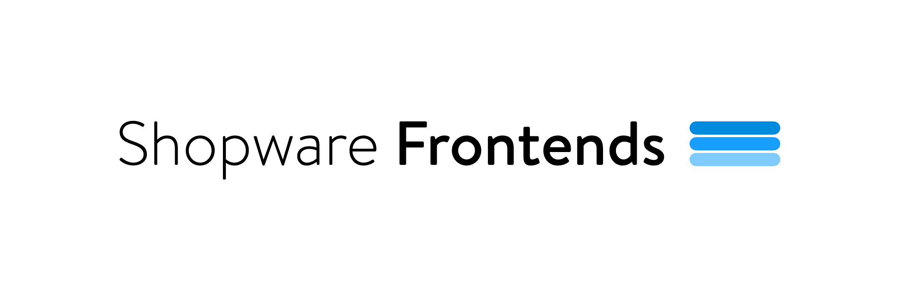
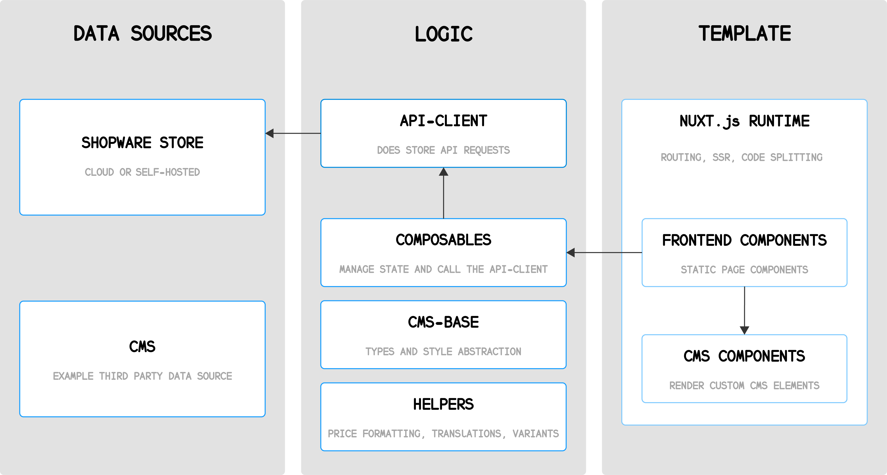
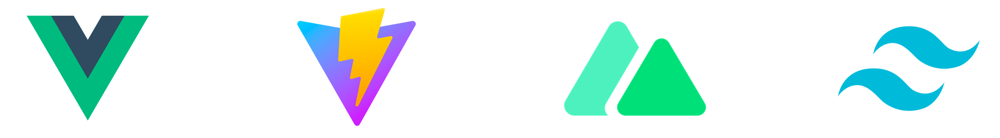

<div align="center">



</div>

<p align="center">
<a href="https://frontends-demo.vercel.app/" target="_blank">🚀 Demo</a> | 📚 <a href="https://frontends.shopware.com/" target="_blank">Docu</a> |  <a href="https://stackblitz.com/github/shopware/frontends/tree/main/templates/vue-demo-store" target="_blank">Try it out</a> | 💬 <a href="https://github.com/shopware/frontends/discussions">Discuss</a> |  <a href="https://shopwarecommunity.slack.com/archives/C050L6NCMGQ" target="_blank">Channel</a>
</p>

<p align="center">
	Shopware Frontends is Shopware's Vue.js <strong>framework</strong> for building custom storefronts.
</p>

---

## Getting started

Node.js v16 or v18 and pnpm are required to run the project.

```sh
# Install dependencies
pnpm i

# Build packages
pnpm run build --filter='./packages/*'

# Run project base
pnpm run dev --filter=vue-demo-store
```

### Run and develop docs

```sh
pnpm run dev --filter='docs'
```

## Architecture

Shopware Frontends is a framework which is divided into separate modules of which some can be used independently.



**API Client**

This package provides abstraction to Shopware's Store API and manages authentication state and request/response schemas.

**Composables**

An opinionated set of Vue.js composables like `useProduct` or `useCustomer` to use business logic and state in any Vue.js project.

**CMS Base**

An implementation of all default Shopware Sections, Blocks and Elements in Tailwind.css.

**Helpers**

A set of helper functions related to price formatting, translation handling, UI state, or URL handling.

**Project Templates**

We offer different project templates to get started with Shopware Frontends.

Our demo store template is a non-production-ready reference implementation of an eCommerce storefront, based on Tailwind.css and Nuxt 3.



See the [templates](templates/) section for other project templates and how to use them.

## Key Features

Shopware Frontends combines the best of the worlds of frontend development, Shopware 6 and your business requirements.

### Shopware native

Shopware Frontends is built for Shopware 6.
No compromises or generic implementations — it works just you would expect it to.
Core concepts like content management, checkout, or payment are deeply integrated and fully functional

### Cloud first

Shopware Frontends is designed to work only with HTTP APIs available in Shopware Cloud.
No themes, plugins or server access required.
Even your developer IDE can be started in the cloud.

### Stable

Shopware Frontends doesn’t rely on Shopware’s volatile internal APIs (such as twig blocks, DAL or Events),
hence not being subject to breaking changes in those APIs, as opposed to Twig Storefront themes.
Especially for big frontend projects this drastically reduces the complexity of platform updates.

### Efficient

There is no lock-in on technologies or frontend tooling. Shopware Frontends comes prepared with a smart default of tooling.
Vue3, Vite, Nuxt3 and unocss (Tailwind.css) — each by themselves coming with a rich ecosystem of tooling, extensions
and integrations can be replaced and extended to meet any projects needs. This tech-stack is the definition of superior Developer Experience and rapid prototyping.

### Flexible

No theming system means no inheritance magic, no compatibility issues, no update efforts, no restrictions
to what your site can look like. Build your site in a lego-block-manner by using prepared templates
or just get creative using all of Tailwind.css’ features.

### Fast

Shopware Frontends is fast during development, deployment and production. It applies server-side-rendering
wherever possible — code splitting, below-the-fold-rendering, and lazy-loading are built into the frontend.
Common metrics like page speed and lighthouse scores are constantly monitored.
