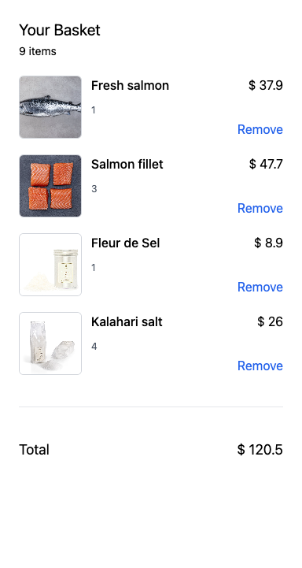

# Cart

## Simple cart

This cart is position in a sticky position on the right side of your screen and contains a basic overview of all products, including their price, quantities and the total price.

<div class="flex flex-col items-center">



</div>

<div>

```vue
<script setup lang="ts">
const { count, refreshCart, cartItems, removeItem, totalPrice } = useCart();

onMounted(() => {
  refreshCart();
});
</script>
<template>
  <div class="fixed right-0 bg-white top-0 w-96 h-screen bg-blue p-6 shadow-lg">
    <h2 class="text-xl">Your Basket</h2>
    <span class="text-sm">{{ count }} items</span>
    <div v-for="item in cartItems" :key="item.id" class="flex gap-3 my-5">
      <div
        class="w-20 h-20 bg-gray-200 overflow-hidden object-cover border border-gray-300 rounded-md"
      >
        
      </div>
      <div class="flex justify-between grow">
        <div>
          <p class="font-medium mb-3">{{ item.label }}</p>
          <p class="text-gray-600 text-xs">{{ item.quantity }}</p>
        </div>
        <div class="text-right flex flex-col justify-between">
          <p>$ {{ item.price.totalPrice }}</p>
          <p
            class="text-blue-600 cursor-pointer hover:underline"
            @click="removeItem({ id: item.id })"
          >
            Remove
          </p>
        </div>
      </div>
    </div>
    <div
      class="mt-10 py-10 border-t border-gray-200 text-lg flex justify-between"
    >
      <span>Total</span><span>$ {{ totalPrice }}</span>
    </div>
  </div>
</template>
```

</div>
