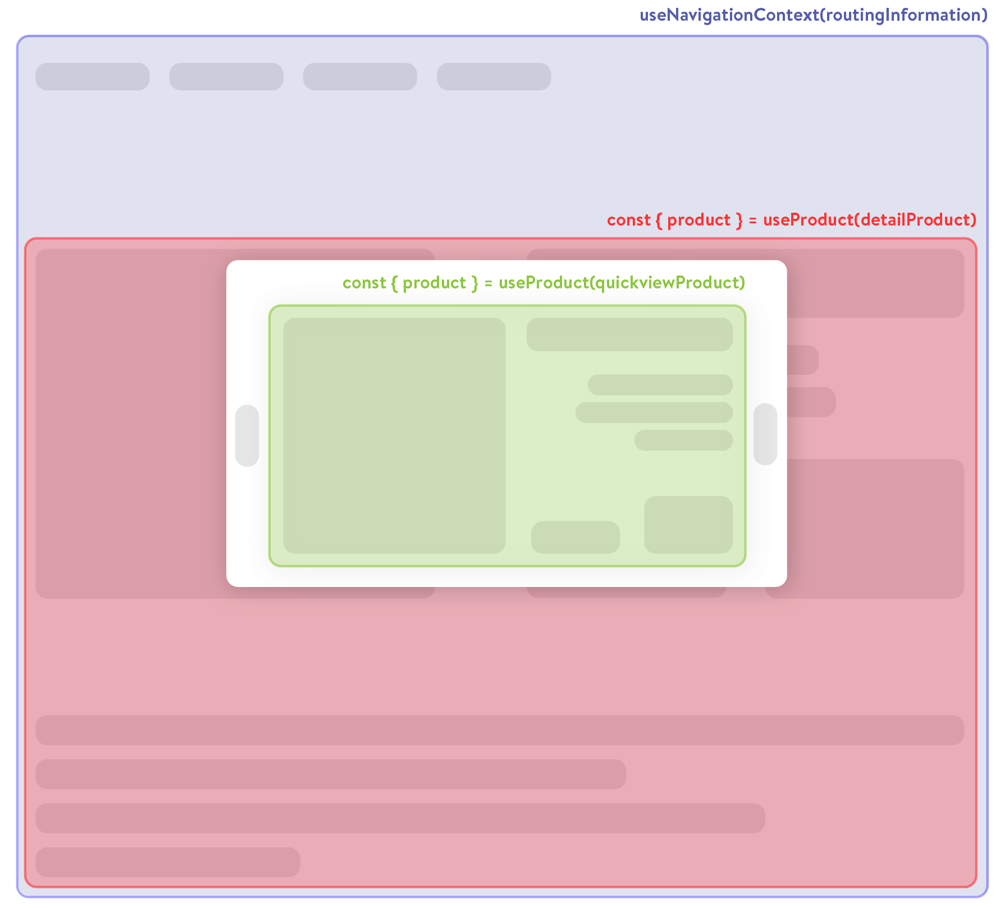

# Context Composables

Composables are containers for reusable logic and state. While some composables are entirely stateless and just provide a set of functions, there are so-called context composables that can share state between parent and child components without the need for property drilling or usage of `provide` and `inject`.

Context boundaries follow the component tree hierarchy, so that a child component can access the state of its parent component without explicit references.

## Why to use context composables

Context composables allow for a more granular way of sharing state between components.

Instead of doing this:

```vue
<!-- Product.vue -->
<script setup lang="ts">
const product = searchProduct();
</script>
<template>
  <div>
    <ProductConfigurator :product="product" />
  </div>
</template>
```

```vue
<!-- ProductConfigurator.vue -->
<script setup lang="ts">
const props = defineProps<{
  product: Product;
}>();
</script>
<template>
  <div>
    <ProductPrice :product="product" />
  </div>
</template>
```

```vue
<!-- ProductPrice.vue -->
<script setup lang="ts">
const props = defineProps<{
  product: Product;
}>();
</script>
<template>
  <div>
    {{ getFormattedPrice(product.price) }}
  </div>
</template>
```

A parent component calls the composable and provides context - all child components can feed off that context. Have a look at the example below:



In the example above, there are multiple usages of the `useProduct` composable and one usage of the `useNavigationContext` composable. All calls create a new context boundary (indicated by the coloured boxes). Within their context boundaries (meaning further down the component tree), the child components can access the state of the parent component.

For example, the call

```js
const { product } = useProduct(detailProduct);
```

creates a new context boundary for all underlying components. The `ProductConfigurator` component can access the `product` state without having to pass it down as a prop.

### Navigation Context <span class="text-blue">(blue)</span>

This context boundary is usually global to the whole application, unless you have explicit requirements for sub-routes within your pages.
Just call the following to access navigation context information from almost anywhere in your application:

```js
const { routeName, foreignKey } = useNavigationContext();
```

### Detail page <span class="text-red">(red)</span>

The detail page component calls the composable with the `detailProduct` parameter and creates a new context boundary (red). Every child component of the detail page can now call

```js
const { product } = useProduct();
```

and access data from the correct product, such as title, description or price.

### Quickview <span class="text-green">(green)</span>

In the quickview component, a new context boundary (green) is created by calling the composable with the `quickViewProduct` parameter.

Again, all children components of the quickview components have access without passing the product context explicitly. You can even use the same components as in the product detail page.

## Using context composables

Context composables are used just as normal composables. However, they have one additional catch. They can be instantiated with and without a `context` parameter. If the `context` parameter is set, a new context boundary is created, which means all child components are able to retrieve the same state. Correspondingly, if the `context` parameter is omitted, the context state is resolved from the closest parent context boundary.

:::info
Internally, context composables use the `provide` and `inject` mechanism from Vue 3.
:::

### Example

See a simple example with the context composable `useCategory` below.

First, fetch a category from the API and store it in the context state by passing it to the `useCategory` composable.

```vue
<!-- Category.vue -->

<script setup>
const { path } = useRoute();
const { search } = useCategorySearch();

const categoryResponse = await search(path);

// Setting the context and creating a context boundary
const { category } = useCategory(categoryResponse);
</script>

<template>
  <CategoryHeader />
</template>
```

Then, use the `useCategory` composable in the child component to retrieve the category from the context state.

```vue
<!-- CategoryHeader.vue -->

<script setup>
// Resolving the category from the closest parent context boundary
const { category } = useCategory();
</script>

<template>
  <h1>{{ category.name }}</h1>
  <p>{{ category.description }}</p>
</template>
```
