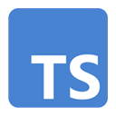

---
head:
  - - meta
    - name: og:title
      content: Shopware Frontends Internal Structure
  - - meta
    - name: og:description
      content: "Details about the internal structure of Shopware Frontends"
  - - meta
    - name: og:image
      content: "https://frontends-og-image.vercel.app/Internal%20Structure?fontSize=150px"
---

# Internal Structure

The internal structure of Shopware Frontends is designed to provide flexibility, reusability and abstraction. Shopware Frontends is a framework that is build with JavaScript and TypeScript.

Some of its components are based on Vue.js and Nuxt.js. The framework is designed to be used mostly with Vue.js and Nuxt.js, but it is not limited to these technologies. You can use it with any other JavaScript framework or library.

This section deals with the different packages and their abstractions. It is sorted by reusability / abstraction level from high to low and shows the main dependencies of each component respectively.

<PageRef title="shopware/frontends packages" sub="Explore all Shopware Frontends packages on GitHub" :icon="githubIcon" page="https://github.com/shopware/frontends/tree/main/packages" target="_blank" />

## api-client

     | <a href="https://www.npmjs.com/package/@shopware/api-client" target="_blank">@shopware/api-client</a>

The API client provides a common interface to access the Shopware API. It can be used standalone in any JavaScript project.

<PageRef page="../packages/api-client.html" title="API Client Reference" sub="Package reference with all services" />

## helpers

     | <a href="https://www.npmjs.com/package/@shopware-pwa/helpers-next" target="_blank">@shopware-pwa/helpers-next</a>

Helpers are functions that can be used for formatting, data manipulation and other stateless tasks within any JavaScript project. They are not tied to any other components.

<PageRef page="../packages/helpers.html" title="Helpers Reference" sub="Package reference with all helper methods" />

## composables

    
     | <a href="https://www.npmjs.com/package/@shopware-pwa/composables-next" target="_blank">@shopware-pwa/composables-next</a>

The composables are a set of Vue.js composition functions that can be used in any Vue.js project. They provide state management, UI logic and data fetching and are the base for all guides in our [building section](./../getting-started/).

<PageRef page="../packages/composables.html" title="Composables Reference" sub="Package API reference with all composables" />

## nuxt3-module

    
    
     | <a href="https://www.npmjs.com/package/@shopware-pwa/nuxt3-module" target="_blank">@shopware-pwa/nuxt3-module</a>

The Nuxt 3 module allows you to set up a Nuxt 3 project with Shopware Frontends. It provides the [composables](#composables) and [api-client](#api-client) packages.

If you want to use these packages with a different Vue.js framework, see the guide for using Shopware Frontends in a [custom project](../getting-started/templates/custom-vue-project.html).

<PageRef page="../packages/nuxt3-module.html" title="Nuxt3 Module Reference" sub="Documentation about setup and basic usage" />

## cms-base

    
    
    
     | <a href="https://www.npmjs.com/package/@shopware-pwa/cms-base" target="_blank">@shopware-pwa/cms-base</a>

The CMS base is a Nuxt module that provides an implementation of all CMS components in Shopware [based on utility-classes](./styling.html) using unocss/Tailwind.css syntax. It is useful for projects that want to use the CMS components but design their own layout.

Head to our [Content Pages](../getting-started/cms/content-pages.html#use-the-cms-base-package) guide to learn more.

<PageRef page="../packages/cms-base.html" title="CMS Base Reference" sub="Package API reference for the CMS composables" />

## Templates & Examples

Our GitHub repository also contains reference implementations for different frameworks and use cases. You can find them in the [templates](https://github.com/shopware/frontends/tree/main/templates) and [examples](https://github.com/shopware/frontends/tree/main/examples) folders. These examples are not directly part of the framework, but can be useful for learning how to use Shopware Frontends.
