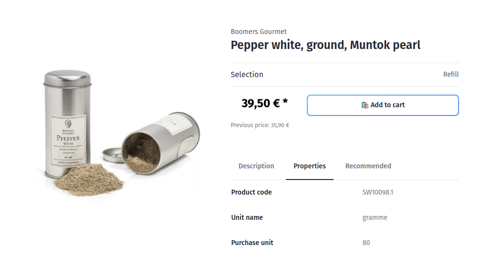

<script setup>
import StackBlitzLiveExample from "../../components/StackBlitzLiveExample.vue";
</script>

# Product Detail Page

In this chapter you will find how to build static product detail page on short example.



## Get Product data

In order to display information of a product there is a `Product` object needed, containing basic information like:

- Name
- Price
- Description
- Properties
- Images
- ...

To achieve that, you can utilize methods available within `composables` package (or directly via API client package named `@shopware/api-client`). In this example we will use [useProductSearch](../../../packages/composables.html#useproductsearch).

:::info Associations
Keep in mind that not every field, or inner object of the `Product` entity is available automatically.
Some of relations need to be assigned explicitly by [associations](https://shopware.stoplight.io/docs/store-api/cf710bf73d0cd-search-queries#associations). The most common case is `media` object like `product.cover` or `product.media`, which keep additional information about the images: img url, thumbnails and so on.
:::

The `useProductSearch` allows us to `search` in the product's collection:

```ts
import type { Schemas } from "#shopware";
import { useProductSearch } from "@shopware-pwa/composables-next";

const { search } = useProductSearch();

const productResponse = await search("some-product-id", {
  /** parameters omitted */
});

// object that keeps a Product entity
const product: Schemas["Product"] = productResponse.product;
// object with variants configuration
const propertyGroups: Schemas["PropertyGroup"][] = productResponse.configurator;
```

Thanks to this, in the response we are able to access `Product` and `configurator` object. The latter is responsible for keeping related variants information to be used for more complex products.

:::info
If you are using Nuxt.js and a `Product` entity object contains `.cmsPage` property, you can also utilize `@shopware-pwa/cms-base` Nuxt 3 module to display the whole Product page designed in Shopping Experiences.
:::

Having source of the data, you can display all you need in your Vue.js template:

```js
import { computed } from "vue";
...
const productName = computed(() => product.value?.translated.name);
const manufacturer = computed(() => product.value?.manufacturer?.name);
const description = computed(() => product.value?.translated.description);
const productNumber = computed(() => product.value?.productNumber);
...
```

## Load additional data asynchronously

Each product can have additional resource loaded asynchronously like Cross-Sells, or Customer Reviews.

Thanks to [useProductAssociations](../../../packages/composables.html#useproductassociations) composable, you can load it providing the product you are on:

```js
const { loadAssociations, isLoading, productAssociations } =
  useProductAssociations(product, {
    associationContext: "cross-selling",
  });
```

## Full source

<PageRef page="https://github.com/shopware/frontends/tree/main/examples/product-detail-page"
  title="Product Detail Page Example"
  target="_blank"
  sub="Explore full example of PDP implementation"
  />

## Live demo

<StackBlitzLiveExample projectPath="shopware/frontends/tree/main/examples/product-detail-page" openPath="/" />
