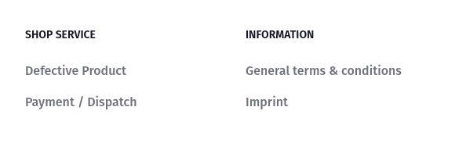

# Footer navigation

::: tip 🙋‍♀️ How to use these example?
Just copy the code snippet and paste it into your project. Sometimes it's useful to create a new component and use it in a higher level component like a page or a layout.
:::



## Explanation

Implementing Footer navigation can be described in few steps:

1. Use [useNavigation](/packages/composables.html#usenavigation) composable to `loadNavigationElements` to display a navigation configured in admin panel.
2. Iterate over `navigationElements` array of categories and display them.
3. Add some static links next-to dynamic ones if needed.
4. Resolve URLs and implement dedicated pages for it.

## Code Example

```vue
<script setup lang="ts">
import { useNavigation } from "@shopware-pwa/composables-next";
import { getCategoryRoute } from "@shopware-pwa/helpers-next";
const { navigationElements, loadNavigationElements } = useNavigation({
  type: "footer-navigation", // footer-navigation selected
});
loadNavigationElements({
  // invoke an API call to fetch navigation categories
  depth: 1,
});
</script>
<template>
  <Transition>
    <footer v-if="navigationElements.length" class="bg-white dark:bg-gray-900">
      <div class="mx-auto w-full max-w-screen-xl">
        <div class="grid grid-cols-2 gap-8 px-4 py-6 lg:py-8 md:grid-cols-4">
          <div v-for="category in navigationElements" :key="category.id">
            <h2
              class="mb-6 text-sm font-semibold text-gray-900 uppercase dark:text-white"
            >
              {{ category.translated.name }}
            </h2>
            <ul
              class="text-gray-500 dark:text-gray-400 font-medium"
              v-if="category?.childCount"
            >
              <li
                class="mb-4"
                v-for="childCategory in category.children"
                :key="childCategory.id"
              >
                <a
                  :href="getCategoryRoute(childCategory)"
                  class="hover:underline"
                  >{{ childCategory.translated.name }}</a
                >
              </li>
            </ul>
          </div>
        </div>
      </div>
    </footer>
  </Transition>
</template>
<style scoped>
.v-enter-active,
.v-leave-active {
  transition: opacity 0.5s ease;
}

.v-enter-from,
.v-leave-to {
  opacity: 0;
}
</style>
```

[getCategoryUrl](/packages/helpers.html#getcategoryurl) method imported from `helpers-next` package can extract a SEO Url or technical URL for given category.

:::warning
`getCategoryUrl` returns absolute path for corresponding category, which means you will get for example `/some-category/some-subcategory` and not the entire URL including domain.

By design, the URL can point also to the Product or Landing Page.
In order to resolve an entity assigned to each category path, utilize a [composable](/packages/composables.html#usenavigation) dedicated for expected entity:

1. `search` from `useNavigationSearch` to find entity type.
2. use [dedicated composable](/getting-started/routing.html#resolve-a-route-to-a-page) to process page resolving.
   :::
