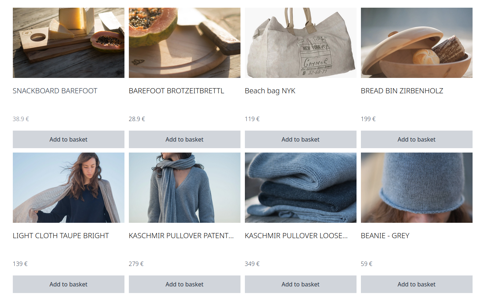

# Product Listing

::: tip 🙋‍♀️ How to use these example?
Just copy the code snippet and paste it into your project. Sometimes it's useful to create a new component and use it in a higher level component like a page or a layout.
:::

## Condensed product listing

This listing shows the product name and price with soft hover effects and a fade-in animation.

<div class="flex flex-col items-center">




</div>

<div>

```vue
<script setup lang="ts">
import { useProductSearchSuggest } from "@shopware-pwa/composables-next";
import { getTranslatedProperty } from "@shopware-pwa/helpers-next";

const { search, searchTerm, getTotal, getProducts } = useProductSearchSuggest();

onMounted(() => {
  // Replace that with your custom logic to fetch products
  searchTerm.value = "sal";
  search();
});

const addProductAndRefresh = async (product) => {
  await addProducts([
    { id: product.id, quantity: 1, type: "product" },
  ]);
  refreshCart();
};

const { addProducts, refreshCart } = useCart();
</script>

<template>
  <div
    class="grid grid-cols-2 md:grid-cols-4 gap-3 max-w-screen-xl mx-auto p-3 transition-opacity pt-32"
    :class="[getTotal > 0 ? 'opacity-100' : 'opacity-0']"
  >
    <div v-for="product in getProducts" :key="product.id" class="h-96 group">
      <div class="h-48">
        <div
          class="h-full w-full object-cover bg-white cursor-pointer overflow-hidden"
        >
          
        </div>
        <div class="h-36 py-5 font-light flex flex-col justify-between">
          <h3
            class="text-xl line-clamp-1 mb-2 group-hover:text-gray-800"
            @click="addProducts([{
              id: product.id,
              quantity: 1,
              type: "product"
            }])"
          >
            {{ getTranslatedProperty(product, "name") }}
          </h3>
          <p class="text-gray-700 group-hover:text-gray-500">
            {{ product.calculatedPrice.totalPrice }} €
          </p>
        </div>
        <div
          class="bg-gray-300 p-2 h-12 flex items-center justify-center text-gray-800 cursor-pointer hover:bg-gray-400"
          @click="addProductAndRefresh({ id: product.id })"
        >
          Add to basket
        </div>
      </div>
    </div>
  </div>
</template>
```

</div>
