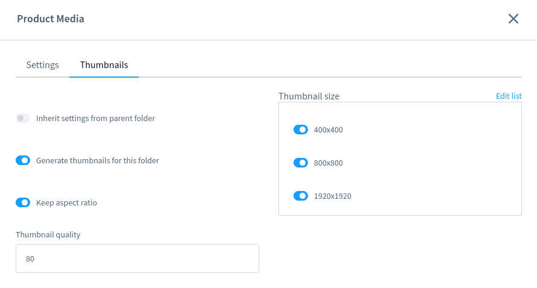

---
head:
  - - meta
    - name: og:title
      content: "Working with Images"
  - - meta
    - name: og:description
      content: "How to display images served by API"
  - - meta
    - name: og:image
      content: "https://frontends-og-image.vercel.app/Working%20with%20**Images**.png?fontSize=110px"
nav:
  position: 30
---

<script setup>
import StackBlitzLiveExample from "../../components/StackBlitzLiveExample.vue";
</script>

# Working with Images

This section covers topics related to images, with a focus on what comes from API.

:::warning Not auto-loaded
Although images are not always contained in API responses, we try to keep the composables logic aware of that and ready to load if they are needed.

Which means if you need to work with images, ensure the requests contains additional [associations](https://shopware.stoplight.io/docs/store-api/cf710bf73d0cd-search-queries#associations).

Example of request's payload with media association included, to avoid an empty `media` object within the response:

```json
{
  "associations": {
    "media": {}
  }
}
```

:::

## Structure of media objects

Media objects can be used in many places, such as:

- CMS objects (containing [CmsElementImage](https://github.com/shopware/frontends/blob/main/packages/composables/src/types/cmsElementTypes.ts#L71) element)
- Product (cover image, image gallery, attributes in type media, etc.)
- Category (main image, ...)
- ...

Regardless the outer container (see [ProductMedia](https://github.com/shopware/frontends/blob/main/packages/types/shopware-6-client/models/content/product/ProductMedia.d.ts#L8) as example) an image object can be wrapped with, the inner structure is reflected in type definition at [Media](https://github.com/shopware/frontends/blob/main/packages/types/shopware-6-client/models/content/media/Media.d.ts#L23)

Let's have a look what's inside:

```json
{
  // irrelevant data omitted
  ...
  "mimeType": "image/webp", // mime-type of media object, supported by the Shopware 6 platform
  "fileExtension": "webp",
  "fileSize": 492024,
  "title": "Frontends Logo",
  "metaData": {
      "hash": "b795091b0a92b8a0605281f710dc1c28",
      "type": 2,
      "width": 3505, // original width
      "height": 5258 // original height
  },
  "alt": "Shopware Frontends",
  "url": "http://localhost/media/shopware-frontends-4P8HWu_NRp4-unsplash.jpg",
  "fileName": "shopware-frontends-4P8HWu_NRp4-unsplash",
  "thumbnails": [ // list of resized images for previously configured ranges
    {
      "width": 1920,
      "height": 1920,
      "url": "http://localhost/thumbnail/ainars-cekuls-4P8HWu_NRp4-unsplash_1920x1920.webp",
    },
    {
      // omitted irrelevant data
      "width": 800,
      "height": 800,
      "url": "http://localhost/thumbnail/ainars-cekuls-4P8HWu_NRp4-unsplash_800x800.webp",
      "apiAlias": "media_thumbnail"
    },
    ...
  ]
  ...
}
```

The media object, and its `thumbnails` list, contain all required information about the file to be used in the browser like URL and sizes.

## Thumbnails and resolutions

By default, every uploaded image is resized to the predefined width and height sizes (in pixels):

- 1920x1920
- 800x800
- 400x400

In order to change those sizes, or add another one (also the quality, or to keep aspect ratio), the values need to be adjusted in administration panel, for specific media folder.



:::warning Image processing
While a file is uploaded, it's been automatically resized for the current configuration in Administration > Media section. Thanks to this, the newly uploaded files will be available for all required dimensions. However keep in mind that if your settings have changes, the new dimensions won't be applied automatically for the old images.
:::

## Helpers

There are few functions that could be used to extract some crucial information about the media in short way. For example [getMainImageUrl](../../packages/helpers#getmainimageurl) or [getMedia](../../packages/helpers#getmedia).

Example how to work with Product's main image:

```ts
import { getMainImageUrl } from "@shopware/helpers";

const coverUrl = getMainImageUrl(product);
// coverUrl is now an URL to the resource (or undefined)
```

## Responsive Images

Having additional information about resized images (see `thumbnails` array in `Media` object), we are able to use them to define [srcset](https://developer.mozilla.org/en-US/docs/Web/HTML/Element/img#attr-srcset) attribute for ``.

```vue{8}
<script>
import type { Schemas } from "#shopware";
const product: Schemas['Product'] = {} // an object omitted
// get the cover media image (main image for a product)
const coverMedia = product.cover?.media
// prepare `srcset` string for available thumbnails
// let the breakpoints be for every width range
const srcset = coverMedia?.thumbnails?.map((thumb) => `${thumb.url} ${thumb.width}w`).join(", ")
</script>

<template>
   
</template>
```

### Live example

Have a look on live example:
<StackBlitzLiveExample projectPath="shopware/frontends/tree/main/examples/responsive-images" openPath="/" />
<br/>

The example above shows how to use dimension sizes configured in admin panel as ranges for viewport. However it can be adjusted to your needs.

The `src` attribute points to the main image URL (not resized) as a fallback.

As long as `thumbnails` array is fulfilled, the same strategy can be applied when we work with every `media` object for each entity available in Shopware 6.

## 3D and spatial media (GLB)

Besides regular images and videos, Shopware media can also be **3D models** in the [GLB](https://registry.khronos.org/glTF/specs/2.0/glTF-2.0.html) format. When a media object has a `.glb` file extension, the `@shopware/cms-base-layer` automatically renders it as an interactive 3D viewer instead of a flat image. This works in:

- **CmsElementImage** and **CmsElementImageGallery** — when the assigned media is a `.glb` file
- **CmsBlockSpatialViewer** — a dedicated CMS block for embedding 3D models

The 3D rendering is handled by the `SwMedia3D` component, which uses [TresJS](https://tresjs.org/) (a Vue wrapper for Three.js) to display the model with orbit controls, lighting, and a perspective camera.

### Why SwMedia3D is not auto-imported

Three.js and TresJS are large libraries. To avoid adding their weight to the initial bundle for every project — even those that never use 3D media — `SwMedia3D` is **excluded from Nuxt's auto-import**. It is loaded on demand via `defineAsyncComponent` only when a spatial media object is actually present on the page. Projects that do not use 3D models pay no bundle-size cost.

### Enabling 3D support

The cms-base-layer provides the `SwMedia3D` component and the dynamic imports, but it does **not** ship the TresJS Nuxt module. To enable 3D rendering in your app, add `@tresjs/nuxt` to your Nuxt modules:

```ts
// nuxt.config.ts
export default defineNuxtConfig({
  modules: [
    // ...other modules
    "@tresjs/nuxt",
  ],
});
```

You do not need to register `SwMedia3D` manually. The cms-base-layer already dynamically imports it wherever spatial media is detected. Once `@tresjs/nuxt` is installed, GLB media in image elements, image galleries, and the Spatial Viewer block will render as interactive 3D viewers automatically.

:::info
If `@tresjs/nuxt` is not installed, components that encounter `.glb` media will attempt to load `SwMedia3D` but the TresJS runtime will not be available. Make sure to install the module before uploading GLB files to your Shopware media library.
:::

<PageRef page="../../best-practices/images.html" title="Best Practices" sub="Best Practices to work with images" />
