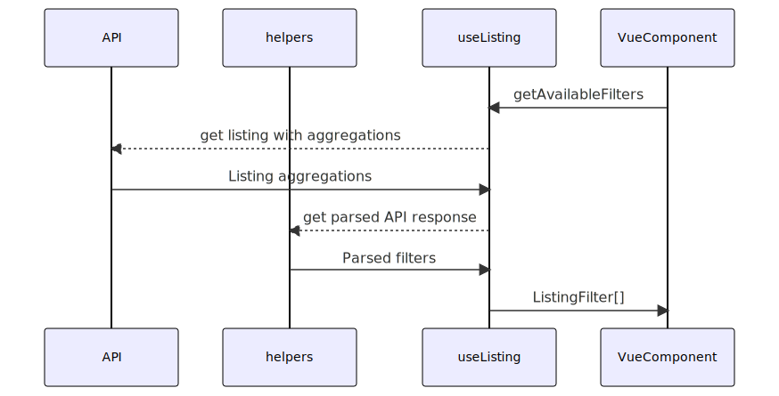
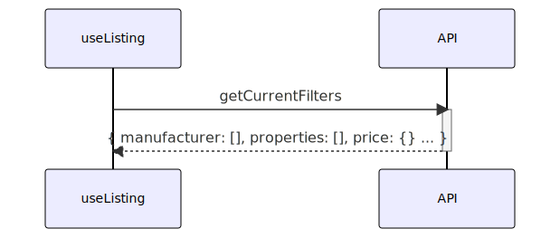

# Create a product listing

In this chapter you will learn how to

- Initialize the `useListing` composable
- Search for products
- Display products in a listing
- Implement a pagination
- Apply sortings, pagination, and filters
- Use the `helpers` package

## Listing context

Product listing is a structure related to the predefined areas and it has always the same interface: `ProductListingResult`:

- Response of product-listing endpoint `/store-api/product-listing/{id}`
- Product search result
- Cms Page (via `product-listing` element, nested among other CMS element)

## Listing type and context

Before using the composable, define the type related to the context:

- `categoryListing` for navigation/category/cms pages
- `productSearchListing` for search page

```ts{3}
const { search, getElements } = useListing({
  listingType: "categoryListing",
  categoryId: "dfd52ab937f840fd87e9d24ebf6bd245",
});
```

The `categoryId` is obligatory only if the current page is not a result of using `useCms` composable (generated from Shopping Experiences).

:::info
If the `useListing` composable is used within a CMS Page, `categoryId` is resolved internally.
:::

## Define search criteria

In order to get the expected products, we need to define the search criteria. This criteria is an object of type Search Parameters explained in [documentation of API](https://shopware.stoplight.io/docs/store-api/cf710bf73d0cd-search-queries).

```ts
const { search } = useListing();

search({
  limit: 2, // get only 2 products
  p: 1, // page 1
  includes: {
    // things we actually need in the response for learning purposes
    product: ["id", "name", "cover", "calculatedPrice"],
    product_media: ["media"],
    media: ["url"],
  },
});
```

:::tip
Don't use [`includes`](https://shopware.stoplight.io/docs/store-api/cf710bf73d0cd-search-queries#includes-apialias) parameter if you want to have the whole entity object available in the response.
:::

## Display listing elements

In order to display products of product listing we need to:

- Invoke the `search()` method with a positive result
- Iterate over `getElements` array of elements, where each element has the `Product` type.

```vue{11,22}
<script setup lang="ts">
const { search, getElements } = useListing(
    listingType: "categoryListing",
    categoryId: "dfd52ab937f840fd87e9d24ebf6bd245", // entrypoint to browse
    defaultSearchCriteria: { // set the default criteria
        limit: 3,
        p: 1,
    },
)

search({ // invoke search() method
  includes: { // omit this parameter if you want to use the whole product entity
    product: ["id", "name", "cover", "calculatedPrice", "translated"],
    product_media: ["media"],
    media: ["url", "thumbnails"],
  },
});
</script>
<template>
 <div>
    <!-- iterate the getElements array -->
    <div v-for="product in getElements" :key="product.id">
        {{ product.name }}
        <!-- use other properties of type Product -->
    </div>
 </div>
</template>
```

## Sorting

Available methods of `useListing` to manage sorting order:

- `getSortingOrders()` - returns all available sorting options
- `getCurrentSortingOrder()` - returns the current order, available in the response
- `changeCurrentSortingOrder()` - sets the new order, invoking a `search` method internally

```ts{3-5}
// part of <script setup> section
const {
  getCurrentSortingOrder,
  getSortingOrders,
  changeCurrentSortingOrder,
} = useListing({
  listingType: "categoryListing",
  categoryId: "dfd52ab937f840fd87e9d24ebf6bd245",
  defaultSearchCriteria: {
    limit: 3,
    p: 1,
  },
});
```

Show all available sortings:

```html
<!-- part of <template> -->
<select>
  <option
    v-for="sortingOrder in getSortingOrders"
    :key="sortingOrder.key"
    :value="sortingOrder.key"
    :selected="sortingOrder.key === getCurrentSortingOrder"
  >
    {{ sortingOrder.label }}
  </option>
</select>
```

Refresh the product listing on option's change:

```ts{4-6}
const onOrderChange = (onOrderChangeEvent: Event) => {
    // accept the DOM Event and extract the option's value
    // pass the value to the listing method that triggers the search() method internally
    changeCurrentSortingOrder(
        (onOrderChangeEvent.target as HTMLSelectElement).value
    );
};
```

Add event listener to the `<select>` element:

```html
<select @change="onOrderChange"></select>
```

## Enable adding to the cart

To achieve this, you can use `useCart` composable which expose `addProduct` method, including other useful functions to manage a cart.

```ts
// part of <script setup> section
const { addProduct } = useCart();
```

Utilize the method in a template:

```html
<!-- part of <template> -->
<div>price: {{ product?.calculatedPrice?.unitPrice }} $</div>
<button @click="addProduct(product)">Add to cart</button>
```

Now, when the customer clicks the `Add to cart` button, a proper request is sent to the API. The cart is then refreshed and is up to date in the entire application.

:::tip
Alternative tip - Instead of using `useCart`, you can use `useAddToCart` composable when you create a separate Vue component to keep a single `Product` for product listing. That option would enhance the code organization.
:::

## Add pagination

Pagination is available by using three methods from `useListing` composable:

- `getCurrentPage`
- `changeCurrentPage` - invokes `search()` method internally with the provided number of the page
- `getTotalPagesCount` - calculates the number of available pages depending on products per page parameters (i.e. `limit` in search criteria)

```ts{5-7}
// part of <script setup> section
const {
    search,
    getElements,
    getCurrentPage,
    changeCurrentPage,
    getTotalPagesCount
} = useListing({
    listingType: "categoryListing",
    categoryId: "dfd52ab937f840fd87e9d24ebf6bd245",
    defaultSearchCriteria: {
        limit: 3,
        p: 1,
    },
})
```

The implementation can look similar to:

```html
<!-- part of <template> -->
<div>
  <div>Pages: {{ getTotalPagesCount }}</div>
  <button
    v-if="getCurrentPage > 1"
    @click="changeCurrentPage(parseInt(getCurrentPage) - 1)"
  >
    prev
  </button>
  <span> {{ getCurrentPage }} </span>
  <button
    v-if="getCurrentPage < getTotalPagesCount"
    @click="changeCurrentPage(parseInt(getCurrentPage) + 1)"
  >
    next
  </button>
</div>
```

## Using Filters

:::info Available Filters
For more information about filters available in the Store API scope, see [Search Queries > Filter](https://shopware.stoplight.io/docs/store-api/cf710bf73d0cd-search-queries#filter)
:::

Available filters are strictly related to the aggregation's object available in the API response.

Built-in aggregations:

- manufacturer
- price
- rating
- shipping-free
- properties (contain all property entities configured in the admin panel)

### Get list of all available filters



[comment]: # "mermaid source: https://gist.github.com/mkucmus/4002882a229c2a9eb60fe83b84483b2b"

The diagram explains the source of available filters. The API response contains aggregations that are parsed into one interface structure.

In order to get the list of available filters, use the following command:

```ts
const { getAvailableFilters } = useListing(/** parameters omitted */);
```

You can then iterate the filter objects available in the array. The filter object has a [ListingFilter](https://github.com/shopware/frontends/blob/main/packages/types/shopware-6-client/response/ListingResult.d.ts#L19) interface and depending on the `code`, or `displayType`, the handling process can be different. Let us have a closer look at it:

`ListingFilter.code`: **manufacturer**

```vue{15,17}
<script setup lang="ts">
const { getAvailableFilters, getCurrentFilters, setCurrentFilters } = useListing(/** parameters omitted */)

const selectManufacturerAndSearch = (manufacturerId: string) => {
  setCurrentFilters({
    code: "manufacturer",
    value: manufacturerId
  })
}

// element from getAvailableFilters.value
// i.e: getAvailableFilters.value?.find(({code}) => code === "manufacturer")?.[0]
const manufacturerFilter: ListingFilter = {
  apiAlias:"manufacturer_aggregation",
  code:"manufacturer",
  label:"manufacturer",
  entities:[
    {
      name:"Boomers Gourmet"
      link:"http://www.gewuerze-boomers.de/"
      id:"1d39db66fd184de8bdcfbf995197f8ea"
      apiAlias:"product_manufacturer"
      // other properties omitted
    },
    { // other manufacturer objects
    }
  ]
}
</script>
<template>
<h3>{{ manufacturerFilter.label }}
  <div v-for="manufacturer in manufacturerFilter?.entities">
    <input
        type="checkbox"
        :id="`filter-mobile-${manufacturerFilter.code}-${manufacturer.id}`"
        :key="manufacturer.id"
        :name="manufacturerFilter.code"
        @click="selectManufacturerAndSearch(manufacturer.id)"
        :checked="getCurrentFilters['manufacturer'].includes(manufacturer.id)"
      />
      <label :for="`filter-mobile-${manufacturerFilter.code}-${manufacturer.id}`">
        {{ manufacturer.name }}
      </label>
  </div>

</template>
```

- All available options for the Manufacturer filter are displayed in `v-for` loop. See `entities` property for the same.
- If the `manufacturer.id` is present in `getCurrentFilters['manufacturer']` array, set the option as checked.
- On the `click` event, invoke `setCurrentFilters({code, value})` method with code (`manufacturer`) and value (specific manufacturer ID) provided.

---

`ListingFilter.code`: **properties**

[Properties](https://docs.shopware.com/en/shopware-6-en/products/properties?category=shopware-6-en/catalogues) is a generic type of filter responsible for displaying property entities that can describe a product that is configured on the backend side.

Despite being in the same filter group, every entity of property defined in the admin panel is available separately.

```ts
const ColorFilter: ListingFiler = {
  name: "Color",
  // other properties omitted
  options: [
    {
      id: "yellow-id",
      name: "Yellow",
      // other props omitted
    },
    {
      id: "green-id",
      name: "Gellow",
      // other props omitted
    },
  ],
};
```

### Apply filter value

In order to apply a specific filter you need to be aware of:

- Filter code (see available codes at [ListingFilterCode](https://github.com/shopware/frontends/blob/main/packages/types/shopware-6-client/response/ListingResult.d.ts#L7))
- Value

```vue
<script setup lang="ts">
const { setCurrentFilters } = useListing(/** parameters omitted */);

setCurrentFilters({
  code: "properties",
  value: "some-property-id",
});

// or

setCurrentFilters({
  code: "rating",
  value: 5, // 5 stars rated products
});
</script>
```

### Get list of applied (active) filters or its options



```vue
<script setup lang="ts">
const { getCurrentFilters } = useListing(/** parameters omitted */);
</script>
<template>
  {{ getCurrentFilters.navigationId }}
  <!-- "category-A-ID-1" -->
  {{ getCurrentFilters.manufacturer }}
  <!-- ["manufacturer-A-option-ID-1"] -->
  {{ getCurrentFilters.price }}
  <!-- { min: 0, max: 299 } -->
  {{ getCurrentFilters.rating }}
  <!-- null -->
  {{ getCurrentFilters.["shipping-free"] }}
  <!-- false -->
  {{ getCurrentFilters.properties }}
  <!-- ["property-A-option-ID-1", "property-A-option-ID-2", "property-B-option-ID-1"]-->
</template>
```

You can achieve that by comparing stored value with displayed one.

| Filter        | Where to find?                       | Data structure                 |
| ------------- | ------------------------------------ | ------------------------------ |
| Manufacturer  | `getCurrentFilters.manufacturer`     | `array[id: string]`            |
| Price         | `getCurrentFilters.price`            | `{ min: number, max: number }` |
| Rating        | `getCurrentFilters.rating`           | `number`                       |
| Shipping free | `getCurrentFilters["shipping-free"]` | `boolean`                      |
| Properties    | `getCurrentFilters.properties`       | `array[id: string]`            |

The selected/active filters for its options/values are flattened and limited only to the bare values.

:::info
Active filters for `Properties` contain only the list of ID's of properties' option. Therefore, they don't have any meta-info explaining what is the source of the option.
:::

## Helpers package

The purpose of `@shopware-pwa/helpers-next` is to make developer's life easier.

In the present case, we could use the product's thumbnail or use the translated name, or even get the product details page's URL, if the application supports a routing.

```ts
// part of <script setup> section
import {
  getProductThumbnailUrl,
  getProductUrl,
  getTranslatedProperty,
} from "@shopware-pwa/helpers-next";
```

```html

<a :href="getProductUrl(product)">
  {{ getTranslatedProperty(product, "name") }}
</a>
```
