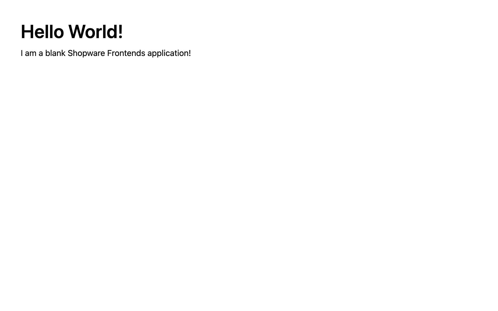

<script setup>
import stackblitzIcon from '../../.assets/framework-icons/stackblitz.png';
</script>

# Blank Template



The blank template contains no UI or markup - it's just a blank Nuxt3 application with pre-installed dependencies, so you can start working on your project right away.

## Setup & run

<PageRef target="blank" title="Run on Stackblitz" page="https://stackblitz.com/github/shopware/frontends/tree/main/templates/vue-blank" sub="Open the Blank Template with our browser IDE in a new window" :icon="stackblitzIcon" />

Alternatively, set up the vue-blank template manually by running the following commands in a new directory:

```bash
npx tiged shopware/frontends/templates/vue-blank vue-blank && cd vue-blank
npm i && npm run dev
```

## Configure

The blank template is pre-configured to connect to a public Shopware backend, so you can follow our [building guides](/getting-started/) right away.

In order to connect it to your own store backend, you need to edit the `nuxt.config.ts` file and add a configuration details:

```ts{4-7}
/* ... */
export default defineNuxtConfig({
  /* ... */
  shopware: {
    endpoint: "https://your-business.shopware.store",
    accessToken: "access-token-from-settings",
  },
  // or
  runtimeConfig: {
    public: {
      shopware: {
        endpoint: "https://your-business.shopware.store",
        accessToken: "access-token-from-settings",
      },
    },
  },
});
```

## What next?

<PageRef page="../page-elements/navigation" title="Build your first component" sub="Now that your blank template is set up, let's work with the main navigation." />
