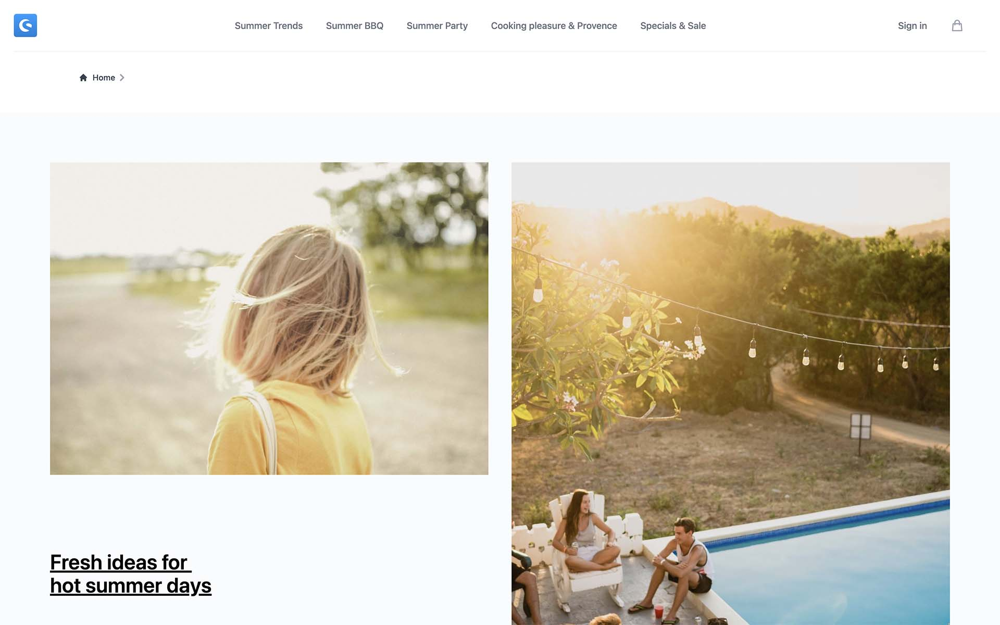

<script setup>
import stackblitzIcon from '../../.assets/framework-icons/stackblitz.png';
</script>

# Demo Store Template

<a href="https://frontends-demo.vercel.app/" target="_blank"></a>

The demo store template is a reference implementation of an online store UI.

:::info
The **Demo Store Template** is not suitable for production stores. It is under constant development and does not adhere to any versioning. Please go to [Limitations](#limitations) for more information.
:::

## Setup & run

<PageRef target="blank" title="Run on Stackblitz" page="https://stackblitz.com/github/shopware/frontends/tree/main/templates/vue-demo-store" sub="Open the Demo Store Template with our browser IDE in a new window" :icon="stackblitzIcon" />

Alternatively, set up the vue-demo-store template manually by running the following commands in a new directory:

```bash
npx tiged shopware/frontends/templates/vue-demo-store demo-store && cd demo-store
npm i && npm run dev
```

## Directory structure

The directory structure is the same as in a [default Nuxt project](https://nuxtjs.org/docs/get-started/directory-structure/):

```json
demo-store/
├─ components/
|  ├─ layout/       /* header, footer, account menu etc. */
|  ├─ checkout/     /* cart items, cart overview */
|  ├─ account/      /* order history, account settings */
|  ├─ shared/       /* modals, notifications */
|  ├─ ...
├─ layouts/
│  ├─ checkout.vue  /* minimal layout without navigation and footer */
│  ├─ default.vue   /* default layout with navigation and footer */
├─ pages/
│  ├─ checkout/     /* checkout pages */
│  ├─ account/      /* user account pages */
│  ├─ ...
├─ app.vue          /* app root component */
├─ nuxt.config.ts   /* app configuration */
├─ package.json
├─ tsconfig.json
```

The `components` directory contains components that have been extracted from their corresponding page components, so these become more readable. The components within `components` are organized based on the page and layout components they are used in. The `shared` directory contains generic components that are used across multiple pages and layouts.

## Customizing the template

There is no concept of overwriting components in the demo store template. Instead, all components are modified directly. When you create a new project, we recommend adding your custom Git repository as a remote repository and keeping the original demo store template as a second repository so that you can always pull changes manually (see als Git Docu [Working with Remotes](https://git-scm.com/book/en/v2/Git-Basics-Working-with-Remotes)).

:::warning Updates & Breaking Changes
The demo store template is a boilerplate, so it will constantly be updated, as we will continously add new features and make improvements. These updates include breaking changes. If you want to stay up to date with the latest changes, you need to keep your project in sync manually.
:::

### CMS Components

One exception to the rule are CMS components. CMS components are handled as a separate package `cms-base` in Shopware Frontends and can be updated automatically. However, you can still override the components from the package in your custom project.

<PageRef page="./../../framework/shopping-experiences" title="Customize CMS Components" sub="Override CMS components using the cms-base package" />

## Configure

The blank template is pre-configured to connect to a public Shopware backend, so you start building right away.

In order to connect it to your own store backend, you need to edit the `nuxt.config.ts` file and edit a configuration object with `shopware` as a key:

```ts
/* ... */
export default defineNuxtConfig({
  /* ... */
  shopware: {
    endpoint: "https://your-business.shopware.store",
    accessToken: "access-token-from-settings",
  }
  // or
  runtimeConfig: {
    public: {
      shopware: {
        endpoint: "https://your-business.shopware.store",
        accessToken: "access-token-from-settings",
      }
    }
  }
});
```

You can also use `.env` file to override this configuration. More about this you can find [here](https://nuxt.com/docs/guide/going-further/runtime-config#environment-variables)

## Limitations

The **Demo Store Template** suggests how to build a store UI with Shopware Frontends. It does not make any assumptions about custom implementations and hence does not contain every feature of Shopware.

Some important limitations are

- Frontend settings are not synchronized from the backend - such as
  - Available fields for checkout and registration
  - Multiple domains
  - Translations and snippets
- No support for multiple currencies

If you think a specific feature should be part of the demo store template, feel free to create an [issue](https://github.com/shopware/frontends/issues/new) or make a [contribution](https://github.com/shopware/frontends/pulls).
