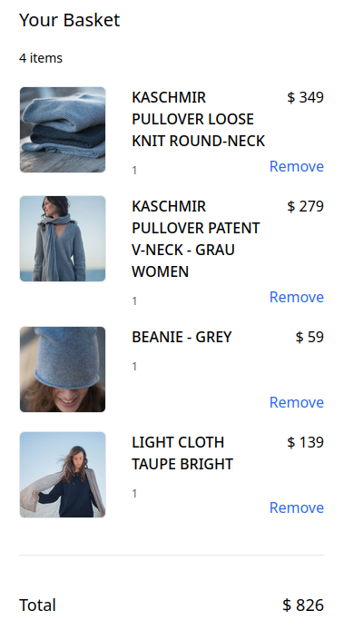

---
head:
  - - meta
    - name: og:title
      content: Building a Cart
  - - meta
    - name: og:description
      content: "In this chapter you will learn how to create and manage a cart."
  - - meta
    - name: og:image
      content: "https://frontends-og-image.vercel.app/Building%20a%20**Cart**.png?fontSize=150px"
nav:
  position: 40
---

# Work with the cart

In this chapter you will learn how to

- Create a cart
- Add products and promotions to a cart
- Remove items from the cart
- Display the cart

## Create a cart

You don't need to create a cart explicitly. Upon calling `refreshCart`, a new cart will be created if it doesn't exist yet. A new cart contains no items.

:::tip
Internally, Shopware's Store API uses the `sw-context-token` header parameter to identify the current user and their cart.
:::

```ts
const { refreshCart } = useCart();

await refreshCart();
```

The `refreshCart` method is called automatically after any action within the cart (add product, remove item, etc.), but can be used explicitly if there was some request made outside the composables, for the same session context.

In a real application, we encourage you to use the `refreshCart` method in client-side calls only (for example using the `onMounted` nuxt hook) - unless required otherwise. It's useful to keep an eye on your browser's network tab to see if there are too many requests to the cart endpoint.

## Add items to the cart

The `useCart` composable also offers methods to add items to the cart, such as

- Products
- Promotions

### Add product to the cart

You can use the `useAddToCart` composable to add a product to the cart:

```vue
<script setup lang="ts">
const product: Product = {
  id: "7b5b97bd48454979b14f21c8ef38ce08",
};
const { addProduct, quantity, getAvailableStock } = useAddToCart({
  product,
});
</script>
<template>
  Only {{ getAvailableStock }} in stock<br />
  <input v-model="quantity" type="number" />
  <button @click="addToCart()">Add to cart</button>
</template>
```

### Add promotion to the cart

The process of adding a promotions code is just as straightforward as adding a product to the cart. You can use the `appliedPromotionCodes` field to receive a list of all applied promotion codes.

```vue
<script setup lang="ts">
const promotionCode = ref<string>();
const { addPromotionCode, appliedPromotionCodes } = useCart();
</script>
<template>
  <input type="text" v-model="promotionCode" />
  <button @click="addPromotionCode(promotionCode)">Apply promotion code</button>
</template>
```

Promitions will appear as a line item in the cart with a negative price.

## Display the cart items

Once the products are added to the cart, the can be accessed through the `cartItems` reference. In a similar fashion, you can access other information like `totalPrice`, `subtotal` or `cartErrors` which can occur in the case of invalid cart configurations.

```vue
<script setup lang="ts">
const { cartItems, totalPrice, count } = useCart();
</script>
<template>
  Items in the cart: {{ count }}<br />
  Total price: {{ totalPrice }}<br />

  <ul>
    <li v-for="cartItem in cartItems" :id="cartItem.id">
      {{ cartItem.label }} - {{ cartItem.price.totalPrice }}
    </li>
  </ul>
</template>
```

Find a table of commonly used properties of cart items below:

| Property       | Description                                                                                                                           |
| -------------- | ------------------------------------------------------------------------------------------------------------------------------------- |
| `id`           | The unique identifier of the cart item                                                                                                |
| `referencedId` | Depends on `item.type`<br>`product`: ID of the referenced product<br>`promotion`: Promotion code if applicable                        |
| `label`        | The label of the cart item                                                                                                            |
| `price`        | `totalPrice`: The total price of the cart item (can be negative)<br>`unitPrice`: Price per unit<br>[More about Prices](./prices.html) |
| `quantity`     | The quantity of units of the cart item                                                                                                |
| `type`         | The type of the cart item - `product` or `promotion`                                                                                  |
| `cover`        | The cover image of the cart item                                                                                                      |

## Change the quantity of a cart item

The `changeProductQuantity` method can be used to change the quantity of a cart item.

```ts
const { changeProductQuantity } = useCart();

const cartItem: LineItem = {
  id: "7b5b97bd48454979b14f21c8ef38ce08",
  quantity: 2,
};

changeProductQuantity(cartItem);
```

## Remove a cart item

You can remove items from the cart using the `useCart` or the `useCartItem` composables:

```ts
const { removeItem } = useCart();

await removeItem({ id: "7b5b97bd48454979b14f21c8ef38ce08" });
```

In case of the `useCartItem` composable, you pass the item identifier when calling the composable, but not when calling the `removeItem` method.

```ts
const { cartItem } = toRefs(props);
const { removeItem } = useCartItem(cartItem);

await removeItem();
```

## Full example: simple cart UI

::: tip 🙋‍♀️ How to use this example?
Copy the snippet and paste it into your project. It's often useful to extract it into its own component and use it in a higher-level component like a page or layout.
:::

This cart is positioned sticky on the right side of the screen and shows a basic overview of all products, including their price, quantities and the total price.

<div class="flex flex-col items-center">



</div>

```vue
<script setup lang="ts">
const { count, refreshCart, cartItems, removeItem, totalPrice } = useCart();

onMounted(() => {
  refreshCart();
});
</script>
<template>
  <div
    class="fixed right-0 bg-white top-0 w-96 h-screen bg-blue p-6 shadow-lg z-10"
  >
    <h2 class="text-xl">Your Basket</h2>
    <span class="text-sm">{{ count }} items</span>
    <div v-for="item in cartItems" :key="item.id" class="flex gap-3 my-5">
      <div
        class="mr-4 h-24 w-24 flex-shrink-0 overflow-hidden rounded-md border border-gray-200"
      >
        
      </div>
      <div class="flex justify-between grow">
        <div>
          <p class="font-medium mb-3">{{ item.label }}</p>
          <p class="text-gray-600 text-xs">{{ item.quantity }}</p>
        </div>
        <div class="text-right flex flex-col justify-between">
          <p>$ {{ item.price.totalPrice }}</p>
          <p
            class="text-blue-600 cursor-pointer hover:underline"
            @click="removeItem({ id: item.id })"
          >
            Remove
          </p>
        </div>
      </div>
    </div>
    <div
      class="mt-10 py-10 border-t border-gray-200 text-lg flex justify-between"
    >
      <span>Total</span><span>$ {{ totalPrice }}</span>
    </div>
  </div>
</template>
```
