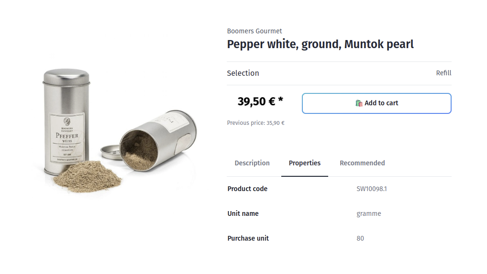
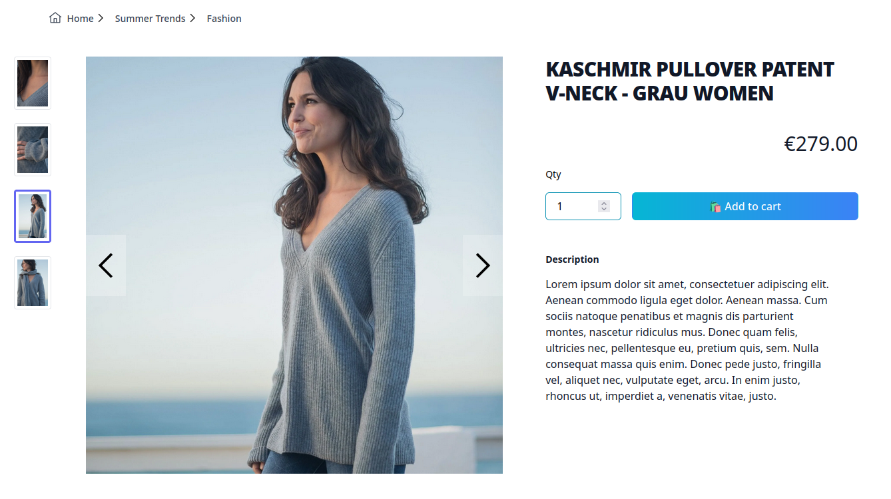

<script setup>
import StackBlitzLiveExample from "../../components/StackBlitzLiveExample.vue";
</script>

# Product Detail Page

In this chapter you will find how to build static product detail page on short example.



## Get Product data

In order to display information of a product there is a `Product` object needed, containing basic information like:

- Name
- Price
- Description
- Properties
- Images
- ...

To achieve that, you can utilize methods available within `composables` package (or directly via API client package named `@shopware/api-client`). In this example we will use [useProductSearch](../../packages/composables/useProductSearch).

:::info Associations
Keep in mind that not every field, or inner object of the `Product` entity is available automatically.
Some of relations need to be assigned explicitly by [associations](https://shopware.stoplight.io/docs/store-api/cf710bf73d0cd-search-queries#associations). The most common case is `media` object like `product.cover` or `product.media`, which keep additional information about the images: img url, thumbnails and so on.
:::

The `useProductSearch` allows us to `search` in the product's collection:

```ts
import type { Schemas } from "#shopware";
import { useProductSearch } from "@shopware/composables";

const { search } = useProductSearch();

const productResponse = await search("some-product-id", {
  /** parameters omitted */
});

// object that keeps a Product entity
const product: Schemas["Product"] = productResponse.product;
// object with variants configuration
const propertyGroups: Schemas["PropertyGroup"][] = productResponse.configurator;
```

Thanks to this, in the response we are able to access `Product` and `configurator` object. The latter is responsible for keeping related variants information to be used for more complex products.

:::info
If you are using Nuxt.js and a `Product` entity object contains `.cmsPage` property, you can also utilize `@shopware/cms-base-layer` Nuxt 3 module to display the whole Product page designed in Shopping Experiences.
:::

Having source of the data, you can display all you need in your Vue.js template:

```js
import { computed } from "vue";
...
const productName = computed(() => product.value?.translated.name);
const manufacturer = computed(() => product.value?.manufacturer?.name);
const description = computed(() => product.value?.translated.description);
const productNumber = computed(() => product.value?.productNumber);
...
```

## Load additional data asynchronously

Each product can have additional resource loaded asynchronously like Cross-Sells, or Customer Reviews.

Thanks to [useProductAssociations](../../packages/composables/useProductAssociations) composable, you can load it providing the product you are on:

```js
const { loadAssociations, isLoading, productAssociations } =
  useProductAssociations(product, {
    associationContext: "cross-selling",
  });
```

## Static example

::: tip 🙋‍♀️ How to use this example?
Copy the snippet and paste it into your project. It's often useful to extract it into its own component and use it in a higher-level component like a page or layout.
:::

A minimal, static rendering of a product detail page - useful as a starting point before wiring up cross-sells, reviews or variant configuration.

<div class="flex flex-col items-center">



</div>

Path: `templates/vue-demo-store/components/product/ProductStatic.vue`

```vue
<script setup lang="ts">
import type { Schemas } from "#shopware";
import { getProductRoute, getTranslatedProperty } from "@shopware/helpers";
import type { Ref } from "vue";

const router = useRouter();

const { search } = useProductSearch();
const { data: productResponse } = await useAsyncData(
  "productExample",
  async () => {
    const productResponse = await search("4fd7aa46370147d4963784e4e8821f8c", {
      withCmsAssociations: true,
    });
    return productResponse;
  },
);

const { product } = useProduct(
  productResponse.value?.product,
  productResponse.value?.configurator,
);
const { loadProductReviews, productReviews } = useProductReviews(product);

onMounted(async () => {
  await loadProductReviews();
});

const productName = computed(() =>
  getTranslatedProperty(product.value, "name"),
);
const manufacturerName = computed(() =>
  getTranslatedProperty(product.value.manufacturer, "name"),
);

const description = computed(() =>
  getTranslatedProperty(product.value, "description"),
);
const properties = computed(() => product.value?.properties || []);

const handleVariantChange = (val: Schemas["Product"]) => {
  const newRoute = getProductRoute(val);
  router.push(newRoute);
};
</script>

<template>
  <div class="m-5 flex flex-row flex-wrap justify-start">
    <!-- Product name for mobile view -->
    <div class="basis-12/12 display lg:hidden">
      <h1
        class="pl-4 py-4 text-2xl font-extrabold tracking-tight text-gray-900 sm:text-3xl"
        v-html="productName"
      />
    </div>
    <div class="basis-12/12 lg:basis-7/12 product-gallery overflow-hidden">
      <ProductGallery :product="product" />
    </div>
    <div class="basis-12/12 lg:basis-5/12 product-description">
      <!-- Product info -->
      <div
        class="max-w-2xl mx-auto pb-16 px-4 sm:px-6 lg:max-w-7xl lg:pb-24 lg:pl-16 lg:pr-0"
      >
        <!-- Product name starting from lg breakpoint -->
        <div
          class="hidden lg:block text-2xl font-extrabold tracking-tight text-gray-900 sm:text-3xl"
          v-html="productName"
        />

        <div
          v-show="manufacturerName !== ''"
          class="lg:col-span-2 lg:pr-8 static-container"
        >
          <div class="container mx-auto pt-8 flex flex-row">
            <div class="basis-2/6 text-right">
              {{ manufacturerName }}
            </div>
          </div>
        </div>

        <!-- Options -->
        <div class="mt-4 lg:mt-0 lg:row-span-3">
          <h2 class="sr-only">Product information</h2>
          <div class="product-variants mt-10">
            <ProductPrice :product="product" />
            <ProductUnits :product="product" class="text-sm" />
            <ProductVariantConfigurator @change="handleVariantChange" />
            <ProductAddToCart :product="product" />
          </div>
        </div>

        <div
          class="py-10 lg:pt-6 lg:pb-16 lg:col-start-1 lg:col-span-2 lg:pr-8"
        >
          <div class="container mx-auto mb-8">
            <!-- Description and details -->
            <div v-if="description">
              <h3 class="text-sm font-bold text-gray-900">
                {{ $t("product.description") }}
              </h3>
              <div class="mt-4 space-y-6">
                <div class="text-base text-gray-900" v-html="description" />
              </div>
            </div>

            <div v-if="properties?.length" class="mt-10">
              <h3 class="text-sm font-medium text-gray-900">
                {{ $t("product.price.properties") }}
              </h3>

              <div class="mt-4">
                <ul role="list" class="pl-4 list-disc text-sm space-y-2">
                  <li
                    v-for="property in properties"
                    :key="property.id"
                    class="text-gray-400"
                  >
                    <span class="text-gray-600">{{
                      getTranslatedProperty(property, "name")
                    }}</span>
                  </li>
                </ul>
              </div>
            </div>

            <div v-if="productReviews?.length" class="mt-10">
              <h3 class="text-sm font-medium text-gray-900">
                {{ $t("product.reviews") }}
              </h3>
              <div v-if="productReviews?.length" class="mt-4">
                <ul role="list" class="pl-4 list-disc text-sm space-y-2">
                  <li
                    v-for="review in productReviews"
                    :key="review.id"
                    class="text-gray-400"
                  >
                    <span class="text-gray-600">{{ review.content }}</span>
                  </li>
                </ul>
              </div>
            </div>
          </div>
        </div>
      </div>
    </div>
  </div>
</template>
```

## Full source

<PageRef page="https://github.com/shopware/frontends/tree/main/examples/product-detail-page"
  title="Product Detail Page Example"
  target="_blank"
  sub="Explore full example of PDP implementation"
  />

## Live demo

<StackBlitzLiveExample projectPath="shopware/frontends/tree/main/examples/product-detail-page" openPath="/" />
