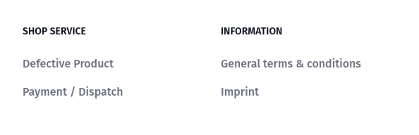

---
head:
  - - meta
    - name: og:title
      content: "Building a footer navigation"
  - - meta
    - name: og:description
      content: "In this chapter you will learn how to build a footer navigation from admin-configured categories."
nav:
  position: 25
---

# Create a footer navigation

Implementing a footer navigation can be described in a few steps:

1. Use the [useNavigation](../../packages/composables/useNavigation) composable to `loadNavigationElements` and display a navigation configured in the admin panel.
2. Iterate over the `navigationElements` array of categories and display them.
3. Add some static links next to the dynamic ones if needed.
4. Resolve URLs and implement dedicated pages for them.



## Code example

```vue
<script setup lang="ts">
import { useNavigation } from "@shopware/composables";
import { getCategoryRoute } from "@shopware/helpers";
const { navigationElements, loadNavigationElements } = useNavigation({
  type: "footer-navigation", // footer-navigation selected
});
loadNavigationElements({
  // invoke an API call to fetch navigation categories
  depth: 1,
});
</script>
<template>
  <Transition>
    <footer v-if="navigationElements.length" class="bg-white dark:bg-gray-900">
      <div class="mx-auto w-full max-w-screen-xl">
        <div class="grid grid-cols-2 gap-8 px-4 py-6 lg:py-8 md:grid-cols-4">
          <div v-for="category in navigationElements" :key="category.id">
            <h2
              class="mb-6 text-sm font-semibold text-gray-900 uppercase dark:text-white"
            >
              {{ category.translated.name }}
            </h2>
            <ul
              class="text-gray-500 dark:text-gray-400 font-medium"
              v-if="category?.childCount"
            >
              <li
                class="mb-4"
                v-for="childCategory in category.children"
                :key="childCategory.id"
              >
                <a
                  :href="getCategoryRoute(childCategory)"
                  class="hover:underline"
                  >{{ childCategory.translated.name }}</a
                >
              </li>
            </ul>
          </div>
        </div>
      </div>
    </footer>
  </Transition>
  <style scoped>
    .v-enter-active,
    .v-leave-active {
      transition: opacity 0.5s ease;
    }

    .v-enter-from,
    .v-leave-to {
      opacity: 0;
    }
  </style>
</template>
```

[getCategoryUrl](../../packages/helpers#getcategoryurl) method imported from the `helpers` package can extract a SEO URL or technical URL for a given category.

:::warning
`getCategoryUrl` returns an absolute path for the corresponding category, which means you will get for example `/some-category/some-subcategory` and not the entire URL including domain.

By design, the URL can also point to a Product or Landing Page.
In order to resolve an entity assigned to each category path, utilize a [composable](../../packages/composables/useNavigation) dedicated for the expected entity:

1. `search` from `useNavigationSearch` to find the entity type.
2. Use a [dedicated composable](../routing.html#resolve-a-route-to-a-page) to process page resolving.
   :::
