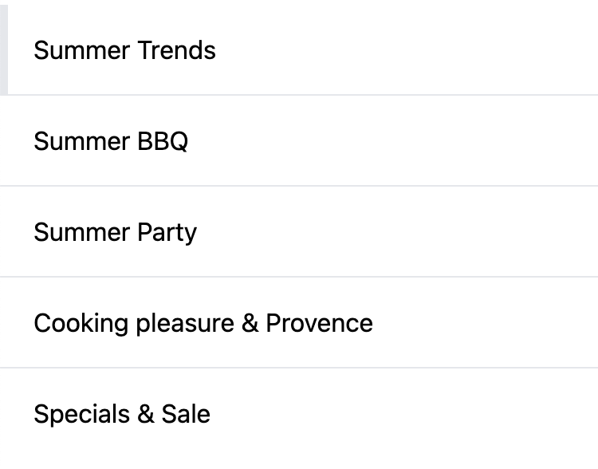

---
head:
  - - meta
    - name: og:title
      content: "Building a navigation"
  - - meta
    - name: og:description
      content: "In this chapter you will learn how to create a navigation."
  - - meta
    - name: og:image
      content: "https://frontends-og-image.vercel.app/Building%20a%20**Navigation**.png?fontSize=150px"
nav:
  position: 20
---

# Create a navigation

In this chapter you will learn how to

- Fetch the navigation of a store
- Display navigation items

## Fetch the navigation

We can retrieve the navigation of a store using the `useNavigation` composable hook.

```js
const { loadNavigationElements, navigationElements } = useNavigation();
```

The `navigationElements` property is a reactive reference to the navigation items which is updated as we fetch the navigation elements:

```js
await loadNavigationElements({ depth: 2 });
```

## Build a navigation template

Now all values can be accessed in the template to build a navigation menu

Note that all the navigation items are in type `Category`, and thanks to this the `getCategoryUrl` helper can be used to extract the correct pretty URL or technical URL as a fallback.

```vue
<script setup lang="ts">
import { getCategoryUrl } from "@shopware/helpers";
const { loadNavigationElements, navigationElements } = useNavigation();
await loadNavigationElements({ depth: 2 });
</script>

<template>
  <ul>
    <li
      v-for="navigationElement in navigationElements"
      :key="navigationElement.id"
    >
      <RouterLink
        :to="getCategoryRoute(navigationElement)"
        :target="
          navigationElement.externalLink || navigationElement.linkNewTab
            ? '_blank'
            : ''
        "
      >
        {{ navigationElement.translated.name }}
      </RouterLink>
    </li>
  </ul>
</template>
```

There is an additional attribute `target` used, in order to open a link in another window (external links or configured as `new tab` link).

## Full example: simple top navigation

::: tip 🙋‍♀️ How to use this example?
Copy the snippet and paste it into your project. It's often useful to extract it into its own component and use it in a higher-level component like a page or layout.
:::

<div class="flex flex-col items-center">




</div>

```vue
<script setup lang="ts">
const { loadNavigationElements, navigationElements } = useNavigation();
await loadNavigationElements({ depth: 2 });

const { path: currentPath } = useRoute();

const isActive = (path: string) => {
  return "/" + path === currentPath;
};
</script>

<template>
  <div class="w-full shadow-lg mb-10 bg-white fixed">
    <nav
      class="w-full flex flex-col divide-gray-200 divide-y md:flex-row md:max-w-screen-xl md:mx-auto md:divide-y-0 md:divide-x"
    >
      <RouterLink
        v-for="navigationElement in navigationElements"
        :key="navigationElement.id"
        :to="'/' + navigationElement.seoUrls[0]?.seoPathInfo"
      >
        <div
          class="flex p-4 h-full border-l-5 hover:border-gray-200 md:border-l-none md:border-b-5 md:w-60 transition duration-200 items-center"
          :class="[
            isActive(navigationElement.seoUrls[0]?.seoPathInfo)
              ? 'border-indigo-500'
              : 'border-white',
          ]"
        >
          {{ navigationElement.translated.name }}
        </div>
      </RouterLink>
    </nav>
  </div>
</template>
```

## Next steps

<PageRef page="./footer-navigation.html" title="Footer Navigation" sub="Build a footer navigation from admin-configured categories" />
<PageRef page="../routing.html" title="Work with routing" sub="Resolve paths and fetch content dynamically" />
