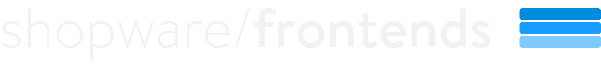

---
---

    
    

Shopware Frontends is a framework for building custom, cloud-native Shopware Storefronts.

## How it works

Frontends is a collection of multiple packages that you can use to implement your custom storefront project.

### Data Sources

Shopware 6 is considered one "supported" data source, but you can integrate any other data source you like - such as CMS or analytics. Shopware Frontends uses the Store API to connect with your Shopware 6 instance at runtime.

### Logic

A big part (and a risk factor) of every custom storefront project is the implementation of domain-specific business functionality. That's why Shopware Frontends offers various packages that take care of some heavy lifting:

- Routing
- Shopping worlds (Shopware CMS) integration
- Translation handling
- Price formatting
- Authentication & state handling

It also comes with TypeScript support.

### Template

You can decide to start from scratch and use no template at all, but we recommend looking at our [Templates](./getting-started/templates.md) if you want to get some guidance up-front.

## Limitations

Shopware Frontends is a framework and not a ready-to-use product. Even it the store template looks like a proper store, it's not an off-the-shelf solution.

In contrast to Shopware's Twig Storefront, Shopware Frontends is not compatible with any apps, themes or plugins. If you want to use third party extensions, you need to ensure that they come with useful Store API endpoints and implement the frontend logic and UI yourself.

We recommend having profound knowledge of Vue.js or another reactive Javascript framework and experience wiht headless frontend architecture when you plan to implement a project with Shopware Frontends.
