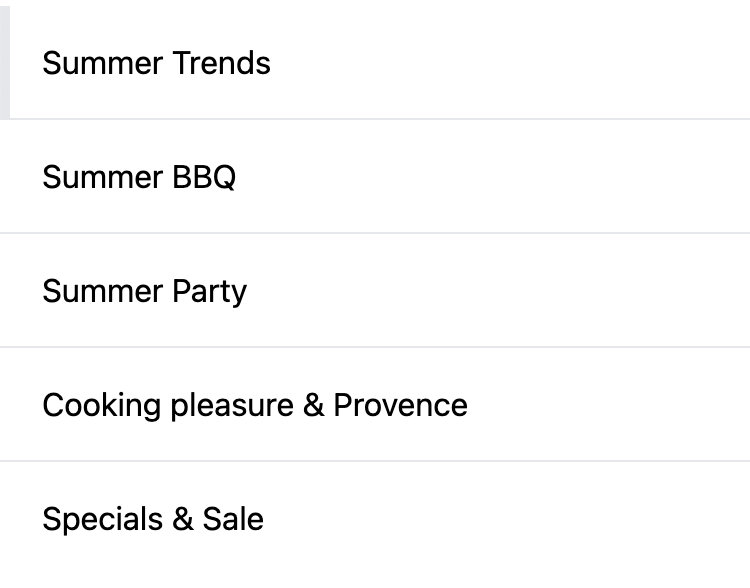
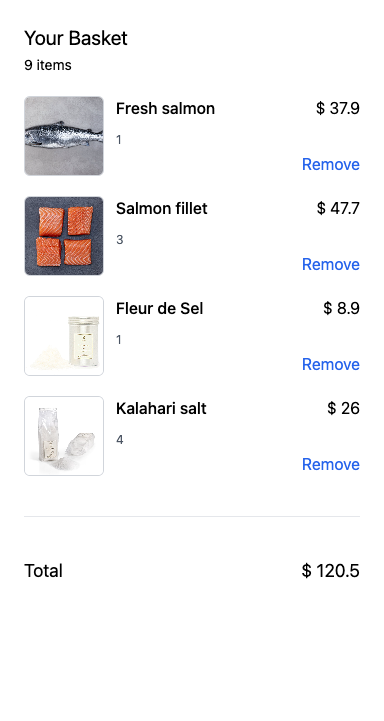
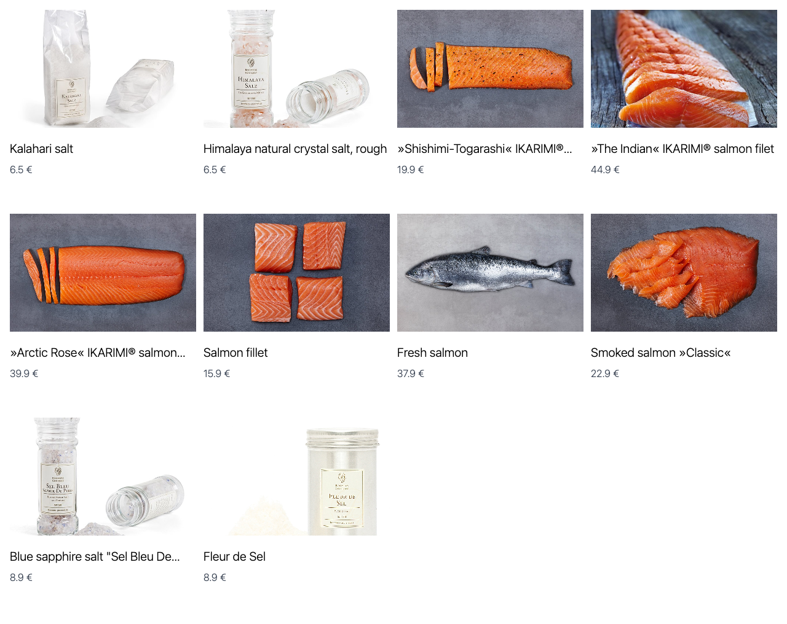
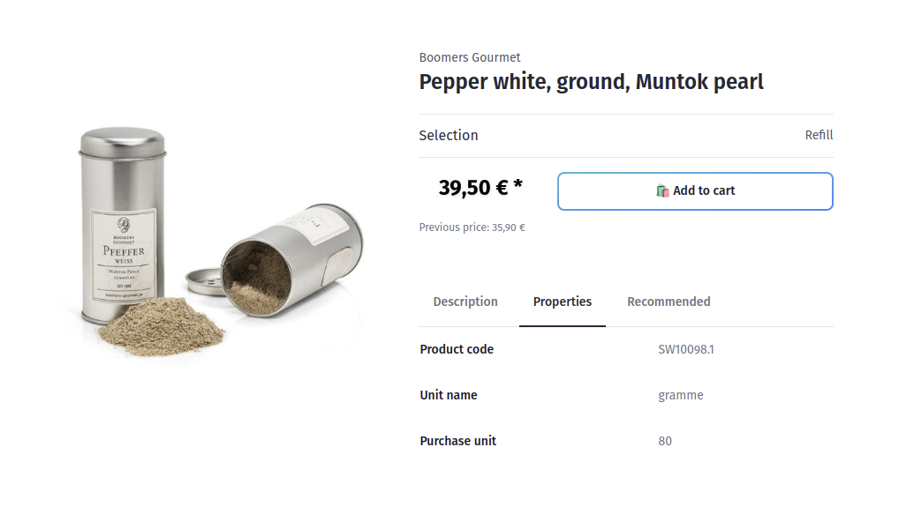

---
nav:
  position: 300
---

# Examples

Have a look at our examples and cookbook recipes to kickstart your frontends project.

::: tip 🙋‍♀️ How to use examples?
Just copy the code snippet and paste it into your project. Sometimes it's useful to create a new component and use it in a higher level component like a page or a layout.
:::

## Navigation

## Cart

## Product Listings

## Product Detail Page

## Footer Navigation

