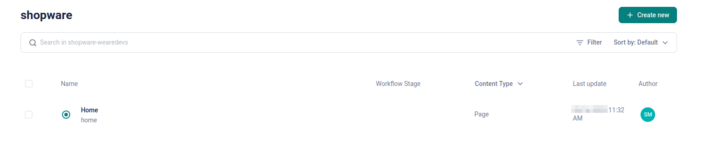
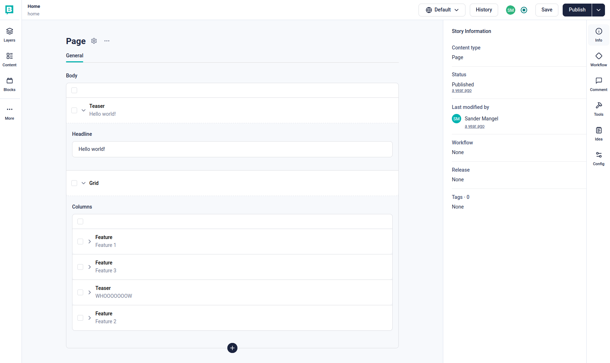
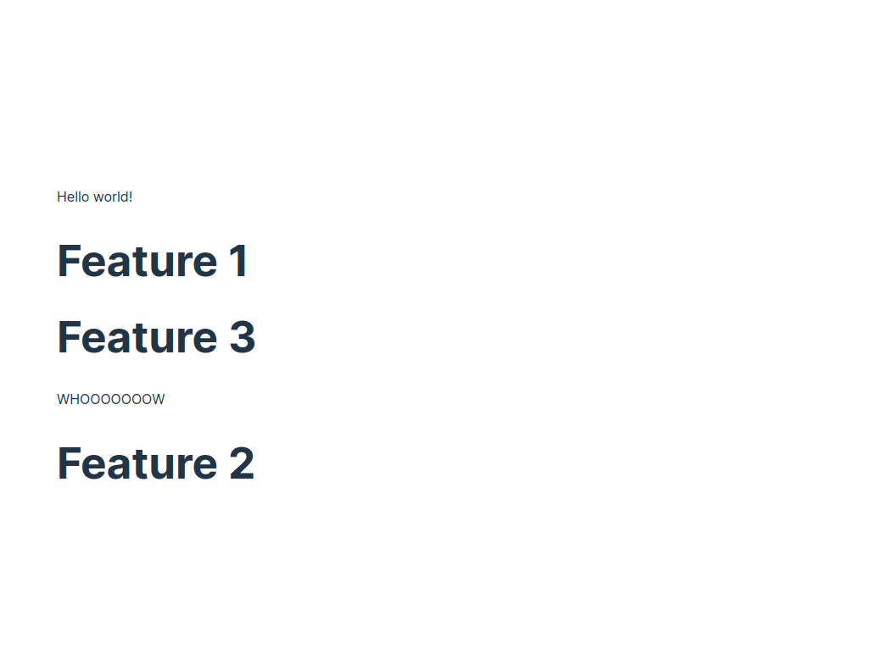

---
head:
  - - meta
    - name: og:title
      content: Storyblok integration (CMS)
  - - meta
    - name: og:description
      content: "In this chapter you will learn how to integrate Storyblok (CMS)."
  - - meta
    - name: og:image
      content: "https://frontends-og-image.vercel.app/Storyblok%20Integration.png?fontSize=120px"
nav:
  position: 10
---

# Storyblok Integration

[](https://www.storyblok.com/docs/guide/introduction)
[](https://www.storyblok.com/docs/guide/introduction)

Storyblok is a headless CMS that can be easily integrated into any Nuxt 3 application.
On this page we explain the basics of how to integrate it into our [vue-blank template](../../../getting-started/templates/blank-template.html).

## Step by step guide

1. Checkout the vue-blank template  
   `pnpx tiged shopware/frontends/templates/vue-blank vue-blank-storyblok && cd vue-blank-storyblok`
2. Install the dependencies and run the dev server  
   `pnpm i && pnpm run dev`
3. Install the [storyblok nuxt module](https://nuxt.com/modules/storyblok)  
   `pnpx nuxi@latest module add storyblok`
4. Install the [storyblok vue](https://github.com/storyblok/storyblok-vue) dependency  
   `pnpm add @storyblok/vue -D`
5. Now add the storyblok access token to you `nuxt.config.ts` file  
   _(you need a storyblok account to get that token)_
   ```ts
   modules: ["@shopware-pwa/nuxt3-module", "@storyblok/nuxt"],
     storyblok: {
     accessToken: "super-secret-token"
   },
   ```
6. In the root directory of your project create a `storyblok` folder.
7. Let's create our base components files inside our `vue-blank-storyblok/storyblok` folder

   **Feature.vue**

   ```vue
   <script setup>
   defineProps({ blok: Object });
   </script>

   <template>
     <div v-editable="blok" class="py-2" data-test="feature">
       <h1 class="text-lg">{{ blok.name }}</h1>
     </div>
   </template>
   ```

   **Grid.vue**

   ```vue
   <script setup>
   defineProps({ blok: Object });
   </script>

   <template>
     <div v-editable="blok" class="flex py-8 mb-6" data-test="grid">
       <div
         v-for="blok in blok.columns"
         :key="blok._uid"
         class="flex-auto px-6"
       >
         <StoryblokComponent :blok="blok" />
       </div>
     </div>
   </template>
   ```

   **Page.vue**

   ```vue
   <script setup>
   defineProps({ blok: Object });
   </script>

   <template>
     <div v-editable="blok" class="px-6" data-test="page">
       <StoryblokComponent
         v-for="blok in blok.body"
         :key="blok._uid"
         :blok="blok"
       />
     </div>
   </template>
   ```

   **Teaser.vue**

   ```vue
   <script setup>
   defineProps({ blok: Object });
   </script>

   <template>
     <div
       v-editable="blok"
       :cat="$attrs.cat"
       class="py-8 mb-6 text-5xl font-bold text-center"
       data-test="teaser"
     >
       {{ blok.headline }}
     </div>
   </template>
   ```

8. Change the `app.vue` file, we adding the `NuxtLayout` and `NuxtPage` components.

   ```vue
   <script setup lang="ts">
   const { refreshSessionContext } = useSessionContext();

   onMounted(() => {
     refreshSessionContext();
   });
   </script>

   <template>
     <NuxtLayout>
       <NuxtPage />
     </NuxtLayout>
   </template>
   <style>
   @import "./style.css";
   </style>
   ```

9. Create `pages/[...all].vue` and `pages/storyblok/[slug].vue` files

   **[...all].vue**

   ```vue
   <script setup lang="ts">
   import Frontends from "../components/Frontends.vue";
   </script>

   <template>
     <div id="app">
       <Frontends template="Blank Vue 3 template (Nuxt)" />
       <NuxtLink to="storyblok/home">Storyblok Home</NuxtLink>
     </div>
   </template>
   <style>
   @import "../style.css";
   </style>
   ```

   **storyblok/[slug].vue**

   ```vue
   <script setup lang="ts">
   const route = useRoute();
   const slug = route.params.slug.toString() ?? "home";
   const story = await useAsyncStoryblok(
     slug,
     { version: "draft", resolve_relations: "Article.author" }, // API Options
     { resolveRelations: ["Article.author"], resolveLinks: "url" }, // Bridge Options
   );
   if (story.value.status) {
     throw createError({
       statusCode: story.value.status,
       statusMessage: story.value.response,
     });
   }
   </script>

   <template>
     <StoryblokComponent v-if="story" :blok="story.content" />
   </template>
   ```

10. Log into your storyblok account and create a page called **home** inside the content.  
    We already linked the slug "home" inside our `[...all].vue` file.
    

    

11. Now start you local dev server and open [this page](http://localhost:3000/storyblok/home).  
    You should see a page looking like the screen below.
    

12. Optional: [Add UnoCSS](https://unocss.dev/integrations/nuxt) for Tailwind CSS support.  
    We already used some Tailwind Classes in the templates.

### Further topics

- [Create a Preview Environment for Your Nuxt 3 Website](https://www.storyblok.com/tp/create-a-preview-environment-for-your-nuxt-3-website)
