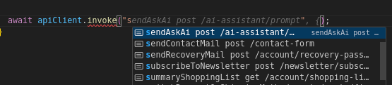

# How to add a new definition

Let's say that our Shopware 6 instance you are currently using, does not have some endpoint documented in OpenAPI Schema specification.

Instead of customizing a backend to add a missing one, you rather want to have it on hand inside you frontend project.

## create a `storeApiTypes.overrides.ts`

Place the mentioned empty file inside `./api-types` dir.

Put the following content:

```ts
#api-types/storeApiTypes.overrides.ts
import type { components as mainComponents } from "./storeApiTypes";

export type components = mainComponents & {
  schemas: Schemas;
};

export type Schemas = {
// here go the entities definitions available, that can be used in operations but also imported and used standalone
};

export type operations = {
// here go the endpoints and its definitions that can refer to the Schemas but it's not a requirement
};
```

## Define a missing Entity

This step is optional, you can skip it if there is nothing to add that will be reused between operations and schemas.

To achieve it add a new key inside `Schemas` exported type:

```ts add={3-9}
#api-types/storeApiTypes.overrides.ts
export type Schemas = {
  AiAnswer: {
    content: string
  },
  AiPrompt: {
    role: "system" | "user" | "assistant",
    content: string
  } 
};
```

## Define a missing endpoint that exists

Add an operation with a unique key and endpoint like `sendAskAi post /ai-assistant/prompt`, then define basic configuration of the request:

```ts add={3-9}
#api-types/storeApiTypes.overrides.ts
export type operations = {
  "sendAskAi post /ai-assistant/prompt": {
      contentType?: "application/json";
      accept?: "application/json";
      body: components["schemas"]['AiPrompt']
      response: components["schemas"]["AiAnswer"];
      responseCode: 200;
  };
}
```

## Re-compile the types

Get ready to the last step at this lesson: recompile the `storeApiTypes.d.ts` output.

```bash
npx @shopware/api-gen generate --apiType=store
```

Now, you can take advantage of a new entity and operation available:




```ts add={14-22,24}
# example.ts 
import { createAPIClient } from "@shopware/api-client";
import type { operations } from "./api-types/storeApiTypes";

export async function setupExample() {
  const shopwareEndpoint = "https://demo-frontends.shopware.store/store-api";
  const accessToken = "SWSCBHFSNTVMAWNZDNFKSHLAYW";

  const apiClient = createAPIClient<operations>({
    baseURL: shopwareEndpoint,
    accessToken: accessToken,
  });

  const promptResult = await apiClient.invoke(
    "sendAskAi post /ai-assistant/prompt",
    {
      body: {
        role: "user",
        content: "Just wanna say Hello world!",
      },
    },
  );

  console.log(promptResult.data.content);
}
```