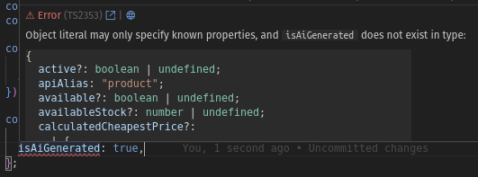

# How to alter only a specific part

This lesson covers a case when you have to alter an existing schema or operation without much effort.

## What is the case?

Let's say your `Product` entity has an extra field: `isAiGenerated` in `boolean` type. 

Unfortunately the backend part isn't updated in terms of this field (at least the OpenAPI Schema isn't), and although the _Client_ receives the property, TypeScript raises an annoying error of not existing field we cannot access.



## Create `storeApiTypes.overrides.json`

Put `storeApiTypes.overrides.json` file in `api-types` folder. 

:::info
The `storeApiTypes.overrides.json` file **MUST** present data in [OpenAPI](https://swagger.io/docs/specification/v3_0/components/) format. 

Content of the file is merged with the basic one (that comes from your Shopware 6 instance) during the work of `npx @shopware/api-gen generate` command.
:::

## Define a field and its type - a patch file

Fill the mentioned file with JSON in structure:

```json
# api-types/storeApiTypes.overrides.json
{
  "components": {
    "Product": {}
  }
}
```

Then, the components should have an entity that need to be updated, in our case it's `Product`.

```json add={4-11}
# api-types/storeApiTypes.overrides.json
{
  "components": {
    "Product": {
      "properties": {
         "isAiGenerated": {
            "type": "boolean"
         },
      },
      "required": ["isAiGenerated"]
    }
  }
}
```

## Register a patch file

The last step of a "coding" phase is to point the newly created patch file to the `api-gen` tool:

In the working dir, create a `api-gen.config.json` file

```json
# api-gen.config.json
{
  "patches": "./api-types/storeApiTypes.overrides.json"
}
```

## Generate types

It's time to generate the types, having everything set up:

```bash
npx @shopware/api-gen generate --apiType=store
```

## Check the results

Let's examine the recent update of `/api-types/storeApiTypes.d.ts`:

```ts add={4}
{
  height?: number;
  id: string;
  isAiGenerated: boolean;
  isCloseout?: boolean;
  /** Runtime field, cannot be used as part of the criteria. */
  isNew?: boolean;
  keywords?: string;
  /** Format: float */
  length?: number;
  //...
}
```

The property has been successfully added and it's available in the _API Client_ right away.