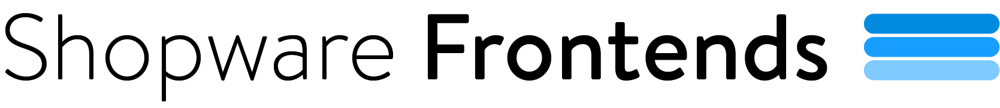

# Sanity CMS example

> **Content + commerce** - a [Sanity](https://www.sanity.io/) Page Builder for
> editorial content, [Shopware](https://developer.shopware.com/frontends/) for
> live products and cart, composed in Nuxt 4.



Editors compose pages from reusable blocks in Sanity Studio; products, prices and
the cart come live from the Shopware Store API. The two systems join on a stable
product ID and never duplicate each other's data.

- 🧩 **Sanity Page Builder** - hero, featured products, rich text, banner, gallery
- 🛍️ **Live commerce** - products resolved from Shopware by ID, server-side
- ✨ **Vibrant UI** - Tailwind, gradients, motion
- 🛒 **Add to cart**, toast notifications, and a **fixed mini cart**

## The idea

| Concern                                                            | Owner        | Why                                     |
| ------------------------------------------------------------------ | ------------ | --------------------------------------- |
| Page layout, sections, copy, images, **which products to feature** | **Sanity**   | editorial, versioned, editor-controlled |
| Product **price, name, stock, availability, media**                | **Shopware** | live commerce data - changes constantly |
| **Cart**, totals, checkout, logged-in user                         | **Shopware** | transactional, per-user, real-time      |

```
Sanity (page.pageBuilder[]) --GROQ--> Nuxt --productIds--> Shopware Store API --> live cards
```

## Project structure

```
sanity-cms/                       # the Nuxt 4 storefront (this folder)
└── app/
    ├── app.vue                   # fetch page -> <PageBuilder>, toasts, mini cart
    ├── sample-home.ts            # bundled demo content (fallback before the Studio has data)
    └── components/
        ├── PageBuilder.vue       # maps each block _type -> section component
        ├── ProductCard.vue       # price + add-to-cart + toast
        ├── MiniCart.vue          # fixed bottom cart (count, total, remove)
        └── sections/
            ├── SectionHero.vue
            ├── SectionFeaturedProducts.vue   # productIds -> live Shopware products (SSR)
            ├── SectionRichText.vue           # Portable Text via <SanityContent>
            ├── SectionBanner.vue
            └── SectionGallery.vue
```

The Sanity Studio (the content editor) is a **standalone** project you create
separately - it is not part of this repo. See [Run it](#run-it).

## Run it

**Storefront**

```bash
pnpm install
pnpm dev          # http://localhost:3000
```

**Studio (CMS)** - to edit content

The Studio is a standalone Sanity project (created separately, not in this repo).
Scaffold one with `npm create sanity@latest`, add the `page` + block schemas, then:

```bash
npx sanity dev    # http://localhost:3333
```

See [Sanity's Studio docs](https://www.sanity.io/docs/studio) for setup and deployment.

The storefront runs with no setup: defaults for a public Sanity dataset and the Shopware demo
sales channel are baked into [nuxt.config.ts](./nuxt.config.ts). Before the Studio
has content, the page renders bundled demo data from
[app/sample-home.ts](./app/sample-home.ts); real Sanity content always wins.

## Configuration

Copy `.env.dist` to `.env` to point at your own project/sales channel:

```bash
NUXT_PUBLIC_SHOPWARE_ENDPOINT="https://demo-frontends.shopware.store/store-api/"
NUXT_PUBLIC_SHOPWARE_ACCESS_TOKEN="<your-sales-channel-key>"
NUXT_SANITY_PROJECT_ID="<your-project-id>"
NUXT_SANITY_DATASET="production"
```

> ⚠️ Product IDs are **per sales channel** - the IDs stored in Sanity must belong
> to the sales channel your `NUXT_PUBLIC_SHOPWARE_ACCESS_TOKEN` points to, or the
> Store API returns `404` and no products resolve.

## The Page Builder

Every block is a Sanity schema (defined in the Studio) plus a Vue component (here):

| Block              | Renders                                                                                 |
| ------------------ | --------------------------------------------------------------------------------------- |
| `hero`             | Animated-gradient hero - eyebrow, heading, subheading, CTA, optional image              |
| `featuredProducts` | Product grid - stores **only Shopware product IDs**; live data resolved at request time |
| `richText`         | Portable Text via `<SanityContent>`                                                     |
| `banner`           | Gradient CTA band                                                                       |
| `gallery`          | Responsive image grid via `<SanityImage>`                                               |

Define these block schemas in your standalone Sanity Studio (a `page` document
with a `pageBuilder` array). Deploy them with `npx sanity schema deploy`. See the
[Sanity schema docs](https://www.sanity.io/docs/schema-types) for details.

## How content drives commerce

The `featuredProducts` block arrives from Sanity with only IDs; the frontend
resolves them to live products (SSR), so cards render in the initial HTML:

```ts
const { search } = useProductSearch();
const { data: products } = await useAsyncData(
  `featured-${section._key}`,
  async () =>
    (
      await Promise.all(
        (section.productIds ?? []).map((id) =>
          search(id)
            .then((r) => r.product)
            .catch(() => null),
        ),
      )
    ).filter(Boolean),
);
```

The **cart** is per-user session state, so it's loaded on the client (`refreshCart`
on mount) and never baked into the cacheable SSR HTML.

## Learn more

- Integration guide: **https://developer.shopware.com/frontends/resources/integrations/cms/sanity.html**
- [`@nuxtjs/sanity` docs](https://sanity.nuxtjs.org/) · [Sanity docs](https://www.sanity.io/docs)

## Try it online

[](https://stackblitz.com/github/shopware/frontends/tree/main/examples/sanity-cms)
