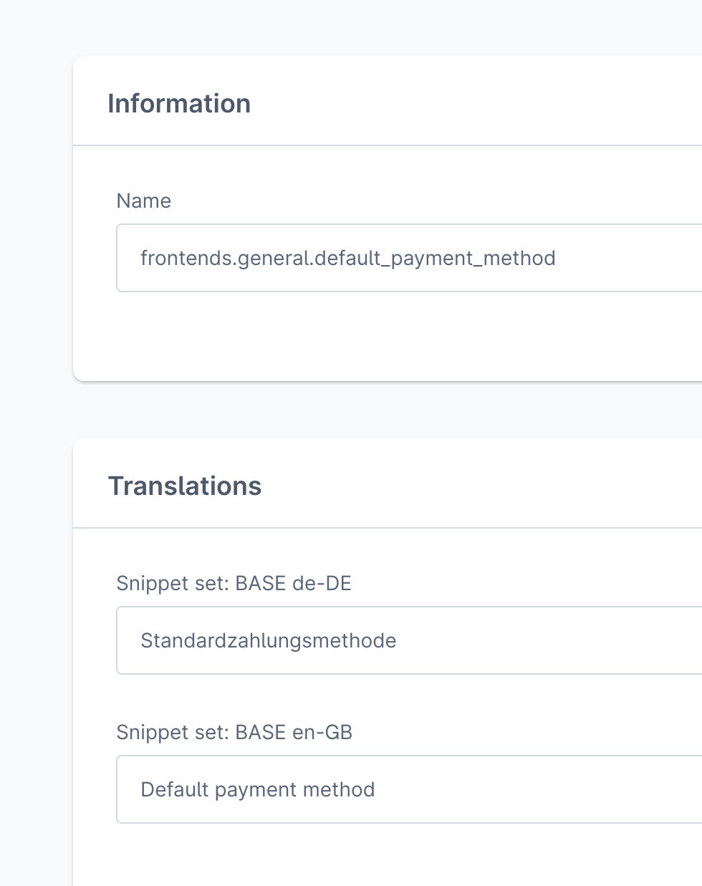

# Working with admin snippets via middleware (Nuxt)


This repository shows an example of how to use translation snippets using admin API accessible by a middleware to use them in **@nuxtjs/i18n** module in the end to translate strings for two languages.

## What's inside

- Nuxt 3 application
- Required libraries installed (api-client, composables, nuxt-module)
- Minimum configuration of Nuxt 3 module
- **Configured i18n module: `i18n` section in `nuxt.config.ts` file**
- **API middleware added: `./server/api/translations.get.ts` file**
- **Component displaying translated phrases for two languages: en-GB & de-DE**
- **dynamic URL resolving** for different languages

## Requirements

Go to [Documentation > Requirements](https://developer.shopware.com/frontends/framework/requirements.html) to see the details.

## The idea

We are going to display translated strings in a Vue Component for two different languages.
The problem is the translation snippets aren't exposed in `store-api` scope, so there is a necessity to fetch them from admin `api` (using special credentials), and expose them via Nuxt Server's API.

1. As a store to keep translations for each language we utilize Snippets system which a part of Shopware 6.

   | translation key                          | en-GB                  | de-DE                     |
   | ---------------------------------------- | ---------------------- | ------------------------- |
   | frontends.general.currency               | Currency               | Währung                   |
   | frontends.general.default_payment_method | Default payment method | Standard-Zahlungsmethode  |
   | frontends.account.is_customer_logged_in  | Is logged in           | Ist der Kunde eingeloggt? |

2. Fetch translations from backend via Admin API (using [@shopware/api-client](https://www.npmjs.com/package/@shopware/api-client)) and expose them via Nuxt's server endpoint ([see Nuxt docs](https://nuxt.com/docs/guide/directory-structure/server))

3. In order to display translated strings, the [@nuxtjs/i18n](https://www.npmjs.com/package/@nuxtjs/i18n) module is used.

   A special helper will take care of displaying, and another will be used to change the current locale (en-GB or de-DE) in order to load a different translations.

## Admin panel: Prepare translations

Go to Settings > Snippets > Choose one > Add snippet ([visit official docs](https://docs.shopware.com/en/shopware-6-en/settings/snippets#creating-a-new-snippet) to see how to achieve this)

For readiness purposes, and to easily distinguish our _frontends_ related snippets we will use an additional prefix for a snippet's key, like:

`general.currency` will become `frontends.general.currency`. Thanks to this, the results can be narrowed down only for our application when [Prefix Filter](https://developer.shopware.com/docs/resources/references/core-reference/dal-reference/filters-reference.html#prefix) type is used in the search query.



Since now, the `/api/snippet` or `/api/search/snippet` will have a newly created translation to be fetched and used in our frontend app.

## Admin panel: setup API credentials for Admin scoped requests

The example does the requests to the Admin API, so it's a good reason to utilize the machine-to-machine authentication grant type, named [Client Credentials](https://shopware.stoplight.io/docs/admin-api/8e1d78252fa6f-authentication#client-credentials).

1. Create a role with READ rights for `snippet` and `snippet_set` only.
2. Create an [Integration](https://docs.shopware.com/en/shopware-6-en/settings/system/integrationen?category=shopware-6-en/settings/system) with that role. Shopware generates an access key ID and a secret access key.
3. Copy `.env.template` to `.env` and paste them in:

```
NUXT_API_CLIENT_ID=<access key ID>
NUXT_API_CLIENT_SECRET=<secret access key>
```

Nuxt maps these variables to `runtimeConfig.api_client_id` and `runtimeConfig.api_client_secret`. The API client in [translations.get.ts](./server/api/translations.get.ts) reads them from there and sends every request with those credentials.

Use your own Shopware instance for this. The public demo instance has no integration for this example anymore. Set `NUXT_PUBLIC_SHOPWARE_ENDPOINT` and `NUXT_PUBLIC_SHOPWARE_ACCESS_TOKEN` in `.env` to the instance that holds your snippets and the integration. Without credentials, `/api/translations` responds with an error and the keys stay untranslated.

## @nuxtjs/i18n configuration

```ts
// nuxt.config.ts
i18n: {
    defaultLocale: "en-GB", // fallback locale
    detectBrowserLanguage: false,
    langDir: "./langs", // resolved inside the ./i18n directory
    locales: [
      {
        code: "en-GB",
        language: "en-GB",
        file: { path: "en-GB.ts", cache: false }, // loader, runs on every locale switch
      },
      {
        code: "de-DE",
        language: "de-DE",
        file: { path: "de-DE.ts", cache: false },
      },
    ],
  },
```

## Translations source

```ts
// ./i18n/langs/en-GB.ts (de-DE.ts is the same)
export default async (locale: string) => {
  return $fetch(`/api/translations?locale=${locale}`); // points to endpoint exposed via ./server/api/translations.get.ts file
};
```

## API middleware - what it does

Server API exposes an endpoint under `/api/translations` for HTTP GET requests that accepts query parameter.

1. It accepts a `locale` query parameter (en-GB, de-DE, ...) to find a snippet set ID (identifier of specific language)
2. Gets all translations for given `snippetSedId`
3. Narrow down the result by applying `prefix` filter with `frontends.` value to have snippets made only for our purposes.

## Install & Run

1. `cp .env.template .env` and fill in the values (see the sections above)
2. `pnpm i` to install deps
3. `pnpm dev` to run the project in dev mode

## Try it online

[](https://stackblitz.com/github/shopware/frontends/tree/main/examples/snippets-middleware)

Create the same `.env` file there, or the translations endpoint has no credentials.

## Pretty URLs resolving

Since the pretty URLs can also be translated, the example shows how to achieve pretty URLS resolving by using available functions shipped by the framework.

`Frontends.vue` component contains a helper method `findRouteForLanguage` that will resolve a proper URL for a given language code:

- translates the locale code to a language ID in the backend
- utilizes `readSeoUrl post /seo-url` operation of [@shopware/api-client](https://www.npmjs.com/package/@shopware/api-client) that is calling under the hood the [SEO URL](https://shopware.stoplight.io/docs/store-api/a5120c0fde5df-fetch-seo-routes) endpoint to get a proper URL for a given language (by using `sw-language-id` header).

the example uses [Summer Trends](https://frontends-demo.vercel.app/Summer-Trends/) page that has a a different URL for different language

## FURTHER STEPS

1. Add caching layers (HTTP Cache / LRU Cache /... ) to speed up
2. Share snippets between app contexts for different users (useNuxtApp / Redis / ... )
3. Store oauth access token to save amount of requests - utilize `onAuthChange` and `sessionData` parameters while creating a client instance using `createAdminAPIClient` method.
