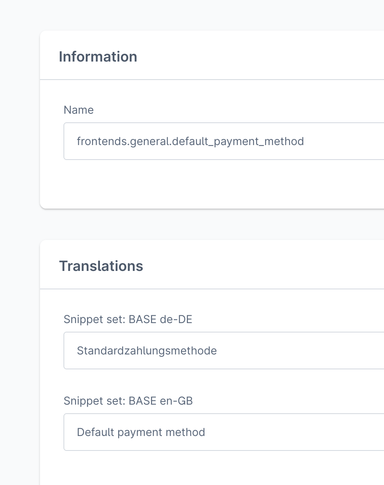

# Working with admin snippets via middleware (Nuxt)


This repository shows an example of how to use translation snippets using admin API accessible by a middleware to use them in **@nuxtjs/i18n** module in the end to translate strings for two languages.

## What's inside

- Nuxt 3 application
- Required libraries installed (api-client, composables, nuxt3-module)
- Minimum configuration of Nuxt 3 module
- **Configured i18n module: `i18n` section in `nuxt.config.ts` file**
- **API middleware added: `./server/api/translations.get.ts` file**
- **Component displaying translated phrases for two languages: en-GB & de-DE**

## Requirements

Go to [Documentation > Requirements](https://frontends.shopware.com/framework/requirements.html) to see the details.

## The idea

We are going to display translated strings in a Vue Component for two different languages.
The problem is the translation snippets aren't exposed in `store-api` scope, so there is a necessity to fetch them from admin `api` (using special credentials), and expose them via Nuxt Server's API.

1. As a store to keep translations for each language we utilize Snippets system which a part of Shopware 6.

   | translation key                          | en-GB                  | de-DE                     |
   | ---------------------------------------- | ---------------------- | ------------------------- |
   | frontends.general.currency               | Currency               | Währung                   |
   | frontends.general.default_payment_method | Default payment method | Standard-Zahlungsmethode  |
   | frontends.account.is_customer_logged_in  | Is logged in           | Ist der Kunde eingeloggt? |

2. Fetch translations from backend via Admin API (using [@shopware/api-client](https://www.npmjs.com/package/@shopware/api-client)) and expose them via Nuxt's server endpoint ([see Nuxt docs](https://nuxt.com/docs/guide/directory-structure/server))

3. In order to display translated strings, the [@nuxtjs/i18n](https://www.npmjs.com/package/@nuxtjs/i18n) module is used.

   A special helper will take care of displaying, and another will be used to change the current locale (en-GB or de-DE) in order to load a different translations.

## Admin panel: Prepare translations

Go to Settings > Snippets > Choose one > Add snippet ([visit official docs](https://docs.shopware.com/en/shopware-6-en/settings/snippets#creating-a-new-snippet) to see how to achieve this)

For readiness purposes, and to easily distinguish our _frontends_ related snippets we will use an additional prefix for a snippet's key, like:

`general.currency` will become `frontends.general.currency`. Thanks to this, the results can be narrowed down only for our application when [Prefix Filter](https://developer.shopware.com/docs/resources/references/core-reference/dal-reference/filters-reference.html#prefix) type is used in the search query.



Since now, the `/api/snippet` or `/api/search/snippet` will have a newly created translation to be fetched and used in our frontend app.

## Admin panel: setup API credentials for Admin scoped requests

The example does the requests to the Admin API, so it's a good reason to utilize the machine-to-machine authentication grant type, named [Client Credentials](https://shopware.stoplight.io/docs/admin-api/8e1d78252fa6f-authentication#client-credentials).

Beforehand, make sure there is a Role with only READ rights you can use later on.
Then create an [Integration](https://docs.shopware.com/en/shopware-6-en/settings/system/integrationen?category=shopware-6-en/settings/system) to generate the API tokens pair.

For demo purposes, we can use the predefined "snippet-reader" integration, having only two ACL's items role: READ `snippet` and READ `snippet-set`:

```
Access key ID: SWIARW9QA2DYOUX3OXJMRGX2UQ
Secret access key: dTRpT3ptZDlmMHZocDNrb2ZOODYxYWtIWnZtRTByUnBvRXh5M3Q
```

(see [translations.get.ts](./server/api/translations.get.ts) file, line 38.)

API Client configured that way will make every requests using those credentials.

## @nuxtjs/i18n configuration

```ts
// nuxt.config.ts
i18n: {
    defaultLocale: "en-GB", // fallback locale
    detectBrowserLanguage: false,
    langDir: "./i18n/langs", // place when `all.ts` entrypoint is stored
    locales: [
      {
        code: "en-GB",
        iso: "en-GB",
        file: "all.ts", // common entrypoint accepting locale code
      },
      {
        code: "de-DE",
        iso: "de-DE",
        file: "all.ts", // common entrypoint accepting locale code
      },
    ],
  },
```

## Translations source

```ts
// ./i18n/langs/all.ts
export default defineI18nLocale(async (locale) => {
  return $fetch(`/api/translations?locale=${locale}`); // points to endpoint exposed via ./server/api/translations.get.ts file
});
```

## API middleware - what it does

Server API exposes an endpoint under `/api/translations` for HTTP GET requests that accepts query parameter.

1. It accepts a `locale` query parameter (en-GB, de-DE, ...) to find a snippet set ID (identifier of specific language)
2. Gets all translations for given `snippetSedId`
3. Narrow down the result by applying `prefix` filter with `frontends.` value to have snippets made only for our purposes.

## Install & Run

1. `pnpm i` to install deps
2. `pnpm dev` to run the project in dev mode

## Try it online

[](https://stackblitz.com/github/shopware/frontends/tree/main/examples/snippets-middleware)

## FURTHER STEPS

1. Add caching layers (HTTP Cache / LRU Cache /... ) to speed up
2. Share snippets between app contexts for different users (useNuxtApp / Redis / ... )
3. Store oauth access token to save amount of requests - utilize `onAuthChange` and `sessionData` parameters while creating a client instance using `createAdminAPIClient` method.
