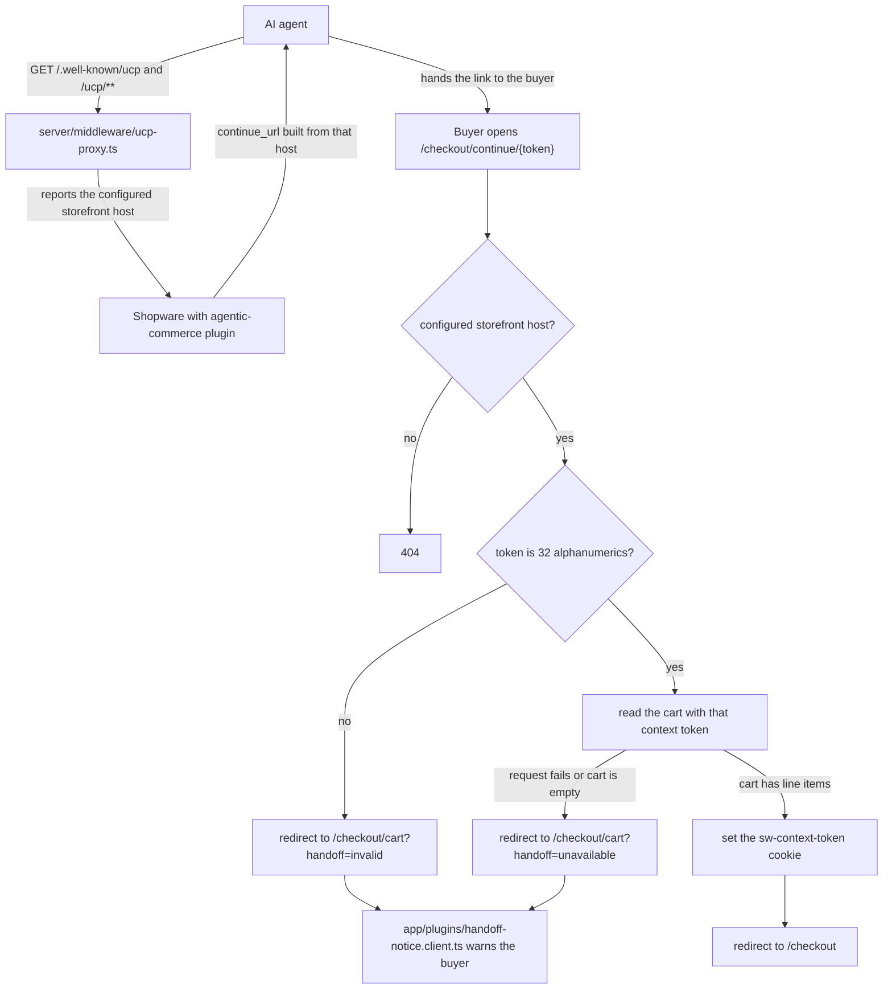

# Vue Agentic Handoff (UCP)

A storefront that takes over checkouts started by AI agents. An agent builds a
cart over the [Universal Commerce Protocol](https://ucp.dev) and hands the
buyer a `continue_url`. This template receives that link and continues the same
cart in the storefront.

It extends [`vue-starter-template`](../vue-starter-template) as a Nuxt layer and
adds only the handoff pieces.

> Status: spike. The routes below work against a Shopware instance with the
> agentic-commerce plugin. The known gaps are listed at the end.

## How the handoff works



## What it adds

| Path                            | What it does                                                                                                                                                     |
| ------------------------------- | ---------------------------------------------------------------------------------------------------------------------------------------------------------------- |
| `/checkout/continue/{token}`    | Target of the UCP `continue_url`. Checks that the token still holds a cart, sets it as the `sw-context-token` cookie and redirects to `/checkout`. Never cached. |
| `/.well-known/ucp`              | Proxied to Shopware. The UCP profile agents discover.                                                                                                            |
| `/.well-known/agent-card.json`  | Proxied to Shopware. The A2A agent card.                                                                                                                         |
| `/ucp/**`                       | Proxied to Shopware. The UCP REST, MCP, A2A, embedded and OAuth endpoints.                                                                                       |
| `Link` header on rendered pages | `</.well-known/ucp>; rel="service-meta"`, the same discovery hint the plugin adds to Shopware Storefront pages.                                                  |

The proxy forwards the storefront host as `X-Forwarded-Host`, together with
`X-Forwarded-Proto` and `X-Forwarded-Port`. It can't use `Host`, because
`fetch()` always sends the target's own host. Shopware resolves the sales
channel from the forwarded host, and builds every URL it hands to the agent
from it: the endpoints in the profile, the `continue_url` and the order
permalink. That is how these URLs end up pointing at this storefront rather
than at Shopware.

When a handoff link can't be used, the buyer lands on the cart with
`?handoff=invalid` or `?handoff=unavailable`, and a notification explains why.

## Shopware setup

1. Install the [agentic-commerce plugin](https://github.com/shopware/agentic-commerce)
   and enable UCP on a Storefront or Headless sales channel whose domains include
   this storefront's URL:

   ```bash
   bin/console ucp:setup --sales-channel=<name> --dev
   bin/console ucp:config:set --sales-channel=<name> \
     --continue-url-template='https://<storefront>/checkout/continue/{checkoutId}'
   ```

2. Let Shopware trust this storefront's server as a proxy, and honor the
   forwarded host. Symfony does not trust `X-Forwarded-Host` by default.
   Set these in Shopware's environment:

   ```bash
   # The addresses this storefront's server reaches Shopware from
   SYMFONY_TRUSTED_PROXIES=127.0.0.1,::1
   SYMFONY_TRUSTED_HEADERS=x-forwarded-for,x-forwarded-host,x-forwarded-proto,x-forwarded-port
   ```

   Without this, Shopware can't map the request to a sales channel domain and
   answers the proxied requests with its domain-mapping error page.

3. Point the template at that instance (`.env`, see `.env.template`):

   ```bash
   NUXT_PUBLIC_SHOPWARE_ENDPOINT=https://<shopware>/store-api/
   NUXT_PUBLIC_SHOPWARE_ACCESS_TOKEN=<access key of that sales channel>
   ```

   The public demo backend has no UCP, so the handoff routes do nothing there.

4. Name the hosts this storefront answers on, in production:

   ```bash
   NUXT_AGENTIC_HANDOFF_STOREFRONT_HOSTS=shop.example.com
   ```

   Shopware builds `continue_url` and the UCP endpoints from the host the proxy
   reports, so a request may not decide it. With this set, the proxy always
   reports the first host, and `/checkout/continue/*` answers on these hosts
   only. Leave it empty for preview deployments, whose URL changes per deploy.

## Development

```bash
pnpm install
pnpm dev
```

## Known gaps

These are open on the Shopware side and are not solved by this template:

- A guest registration or login in the storefront rotates the context token.
  The plugin's checkout record moves with it, so the agent can no longer read
  its checkout.
- An order placed in the storefront after the handoff is not linked back to the
  UCP checkout, so the agent never sees it complete.
- Buyer details the agent collected (email, name, address) are not available
  through the Store API, so the guest checkout form starts empty.
- Following a handoff link replaces the cart already in this browser.
