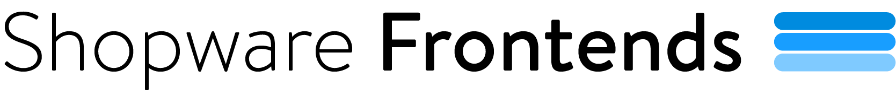

# Demo template (Nuxt)



This repository is an example demo application built with Shopware Frontends Framework and Nuxt 4.

> **⚠️ Do not use this template to start a new project.** Use the [Vue Starter Template](https://github.com/shopware/frontends/tree/main/templates/vue-starter-template) instead. It builds on Nuxt layers, so it stays maintainable and picks up updates automatically.
>
> This template is deprecated. It stays in the repository as a reference implementation. Read it for patterns, do not build on it.

## What's inside

- Nuxt 4 application
- Required libraries (API client, CMS components, composables, Nuxt module)
- Pre-configured demo Shopware 6 API

## Requirements

Go to [Documentation > Requirements](https://developer.shopware.com/frontends/framework/requirements.html) to see the details.

## Set up your Shopware 6 instance

To connect to a different API, adjust the API credentials in the `nuxt.config.ts` file:

`Shopware:`{`endpoint` and `accessToken`}.

## Install & Run

1. `pnpm i` to install dependencies
2. `pnpm dev` to run the project with the development server

## Generate your own API types

By default API types are delivered from our [demo instance](https://frontends-demo.vercel.app/).
To generate your own types use [@shopware/api-gen](https://www.npmjs.com/package/@shopware/api-gen) CLI.

1. update `.env` file with your Shopware API information
2. load JSON schema from your instance `pnpx @shopware/api-gen loadSchema --apiType=store --filename=storeApiSchema.json`
3. generate types `pnpx @shopware/api-gen generate --apiType=store` (or run `pnpm generate-types`)

> [!NOTE]
> Do not edit your `api-types/storeApiTypes.d.ts` file. It will be overwritten on the next schema generation. Instead use your `shopware.d.ts` file to extend types.

## Styling and Shopping Experiences integration

This tempalte uses [UnoCSS](https://unocss.dev/) for styling, which is a utility-first CSS framework. It is configured to use the [Tailwind CSS](https://tailwindcss.com/) classes.

The template also includes a [CMS Base nuxt layer](https://www.npmjs.com/package/@shopware/cms-base-layer) to provide the CMS components for Shopping Experiences integration. The layer is registered in the `nuxt.config.ts` file. In order to override the default Tailwind CSS configuration, you can create your own `uno.config.ts` file in the root of your project and extend the default configuration.

## Production

Refer to to the Shopware documentation for best practices on deploying a production JavaScript application with Shopware: [Best Practices > Deployment](https://developer.shopware.com/frontends/best-practices/deployment.html)

### Running the application with Node.js

Execute the `build` script to build the application:

```bash
pnpm build

# or npm run build
# or yarn build
```

Execute the `start` script to run the application:

```bash
pnpm start

# or npm run start
# or yarn start
```

### Running Composable Frontends with Docker

Have a look at the [docker-composable-frontends repository](https://github.com/shopwareLabs/docker-composable-frontends).

> [!NOTE]
> We recommend using a local Shopware 6 development instance ([devenv](https://developer.shopware.com/docs/guides/installation/devenv.html#devenv)) and then [configuring](https://developer.shopware.com/frontends/introduction/templates/demo-store-template.html#configure) Composable Frontends to use your local instance.

### Nitro presets

More information on generating different outputs can be found [here](https://nitro.unjs.io/deploy).
Our recommendation is to use `.env` file for changing platform presets

#### Vercel serverless functions and ISR

There is an [issue](https://github.com/nitrojs/nitro/issues/1880) with Vercel serverless functions and ISR for catch-all route and dynamic data that depends on GET query parameters.

To fix it, you need to do one of the following:

- disable `isr` for the catch-all route:

  ```js
    // nuxt.config.ts
    routeRules: {
      "/**": {
        isr: false
      },
    }
  ```

- switch to `vercel-edge` platform by setting the corresponding preset:

  ```bash
  # package.json build script
  NITRO_PLATFORM=vercel-edge pnpm build
  ```

  or set the `NITRO_PLATFORM` env right in vercel dashboard.
